# 实验一 进程、线程相关编程实验
## 1. 实验概述
1.1中，`fork_with_wait.c`文件依次创建了父进程并在父进程中创建了子进程，并输出了父进程和子进程的进程标识；之后，在`fork_WITHOUT_wait.c`文件中删去`wait()`函数，观察父进程与子进程的执行顺序；再之后，在`fork_GlobalVariable.c`和`fork_BeforeReturn`中设置一个全局变量，并在父进程与子进程中对其进行不同的操作，观察创建子进程时，来自父进程的数据是如何被继承的；之后，在`fork_syscall.c`和`fork_exec.c`中分别调用`system()`和`exec()`族函数，试图用一个额外的文件`system_call.c`覆盖子进程的代码块。  
1.2中，`thread_race.c`文件在一个进程中创建两个线程`thread1`和`thread2`，设置同一个变量，进行不同操作并观察两个线程的竞争；之后，在`mutual_exclusion.c`文件中定义了信号量并采用该互斥信号量实现了共享变量的互斥访问。之后，在`thread_syscall.c`和`thread_exec.c`中，分别采用系统调用方法和`exec()`族函数，试图用`system_call.c`文件覆盖线程的剩余部分，并输出线程的线程标识和进程标识。
1.3中，在`spinlock.c`文件中实现了一个自旋锁，以此实现对共享变量的互斥访问和忙等待。  
## 2. 代码描述
### 2.1 进程
#### 2.1.1 fork_with_wait
用库函数实现父进程等待子进程，核心代码如下：
```C
int main()
{    
pid_t pid, pid1;
    
    /* fork a child process */
    pid = fork();

    if(pid < 0){ /* error occured */
        fprintf(stderr, "Fork Failed!");
        return 1;
    }
    else if(pid == 0){ /* child process */
        pid1 = getpid();
        printf("child: pid = %d", pid); //A, pid expected to be 0
        printf("child: pid1 = %d", pid1); //B, pid expected to be child's pid
    }
    else{/* parent process */
        pid1 = getpid();
        printf("parent: pid = %d", pid); //C, pid expected to be child's pid
        printf("parent: pid1 = %d", pid1); //D, pid1 expected to be parent's pid
        wait(NULL);//wait until child ends
    }

    return 0;
}
```
父进程将等待子进程结束后，才能继续执行`wait()`函数后面的内容。  
输出结果如下：
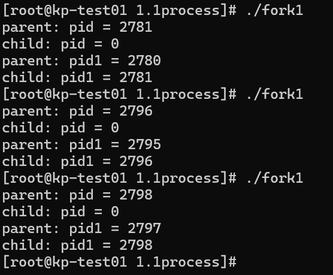  
`fork()`函数调用一次，返回两次，在父进程中返回子进程的pid，子进程中返回0. ABCD四处的返回如代码中注释。
#### 2.1.2 fork_WITHOUT_wait
去掉了父进程中的`wait()`函数，核心代码如下：
```C
int main()
{    
pid_t pid, pid1;
    
    /* fork a child process */
    pid = fork();

    if(pid < 0){ /* error occured */
        fprintf(stderr, "Fork Failed!");
        return 1;
    }
    else if(pid == 0){ /* child process */
        pid1 = getpid();
        printf("child: pid = %d\n", pid); //A, pid expected to be 0
        printf("child: pid1 = %d\n", pid1); //B, pid expected to be child's pid
    }
    else{/* parent process */
        pid1 = getpid();
        printf("parent: pid = %d\n", pid); //C, pid expected to be child's pid
        printf("parent: pid1 = %d\n", pid1); //D, pid1 expected to be parent's pid
        // wait(NULL);
    }

    return 0;
}
```
父进程无需等待子进程的终止即可终止。运行结果如下：
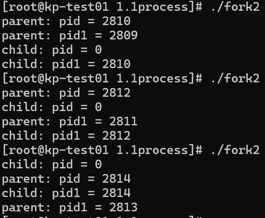  
对返回值的分析应与去掉`wait()`函数前一致，不加赘述。
#### 2.1.3 fork_GlobalVariable
设置一个全局变量
```C
int global_value;
```
以供父进程和子进程执行不同操作。核心代码如下：
```C
......
    else if(pid == 0){ /* child process */
        pid1 = getpid();
        global_value--;
        /*
        printf("child: pid = %d/n", pid); //A, pid expected to be 0
        printf("child: pid1 = %d/n", pid1); //B, pid expected to be child's pid
         */
        printf("child: value = %d\n", global_value);
    }
    else{/* parent process */
        pid1 = getpid();
        global_value++;
        /*
        printf("parent: pid = %d/n", pid); //C, pid expected to be child's pid
        printf("parent: pid1 = %d/n", pid1); //D, pid1 expected to be parent's pid
        wait(NULL);  //wait until child ends
         */
        printf("parent: value = %d\n", global_value);
    }
......
```
在子进程中，对全局变量自减1；在父进程中，对全局变量自加1.输出结果如下：
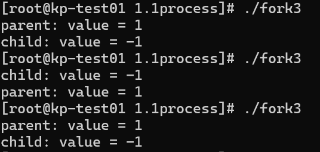  
由输出结果发现，父进程和子进程输出的全局变量的值**并不相同**。  
假设它们共享同一份数据空间，则应当享有相同的全局变量的值，输出也应当相同。这种假设与实际输出结果不符。  
对该现象的一种合理解释是，**子进程在被创建时自动地继承父进程的数据空间的一份副本**。即，子进程的数据空间是独立于父进程的，但子进程的数据在内容上时父进程的拷贝。这样，在父进程和子进程中分别做不同的操作，最终输出的值也不相同。
#### 2.1.4 fork_BefornReturn
在上一步基础上，在`return`前增加对全局变量的操作。核心代码块如下：
```C
    ......

    else if(pid == 0){ /* child process */
        pid1 = getpid();
        global_value--;
        /*
        printf("child: pid = %d/n", pid); //A, pid expected to be 0
        printf("child: pid1 = %d/n", pid1); //B, pid expected to be child's pid
         */
        printf("child: value  = %d\n", global_value);
        printf("child: &value = %d\n", &global_value);
    }
    else{/* parent process */
        pid1 = getpid();
        global_value++;
        /*
        printf("parent: pid = %d/n", pid); //C, pid expected to be child's pid
        printf("parent: pid1 = %d/n", pid1); //D, pid1 expected to be parent's pid
        wait(NULL);  //wait until child ends
         */
        printf("parent: value  = %d\n", global_value);
        printf("parent: &value = %d\n", &global_value);
    }

    global_value = global_value + 10;
    printf("global_variable = %d\n", global_value);

    return 0;

    ......

```
增加操作为全局变量自加10
```C
global_value = global_value + 10;
```
输出结果如下：
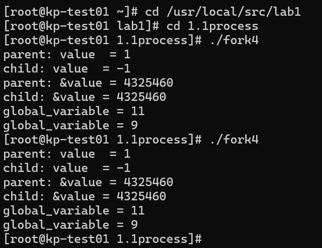  
从输出结果来看，两个进程输出的`value`**值并不相同**，这印证了刚才的分析，即创建子进程时，数据并不共享，子进程继承一份父进程数据空间的拷贝；两个进程输出的`&value`**相同**，即地址空间相同。这里输出的地址空间是**虚拟内存地址**（定义变量时，系统分配的虚拟内存地址），映射到物理内存时，并不会映射到同一片空间。  
#### 2.1.5 fork_systemcall
通过系统调用，用文件`system_call.c`的代码段作为子进程的代码段，核心代码如下：  
```C
    ......
    
    else if(pid == 0){ /* child process */
        pid1 = getpid();
        if(system("./system_call") == -1)
            perror("system_call");
        printf("child process PID: %d\n", pid1);
    }
    else{/* parent process */
        pid1 = getpid();
        printf("child process1 PID: %d\n", pid);
        printf("parent porcess PID: %d\n", pid1);
        wait(NULL);//wait until child ends
    }

    ......

```  
在子进程中调用系统调用`system()`，创建一个新进程，并使用`system_call`文件作为新进程的代码段，以此实现让父进程和子进程实现不同的操作。输出结果如下：  
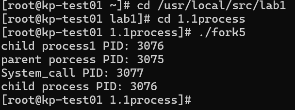  
由输出可知，子进程的剩余部分被系统调用覆盖，执行了与父进程不同的函数体。  
#### 2.1.6 fork_exec
通过`exec()`族函数，用`system_call.c`文件覆盖子进程剩余部分代码。核心代码块如下：  
```C  
    ......

    else if(pid == 0){ /* child process */
        execlp("./system_call", "system_call", NULL);
        /* If execlp() failed, the following child process will NOT be covered and will be executed to tell an error */
        perror("exec");
        exit(1);
    }
    else{/* parent process */
        pid1 = getpid();
        printf("child process1 PID: %d\n", pid);
        printf("parent porcess PID: %d\n", pid1);
        wait(NULL);//wait until child ends
    }

    ......
```  
在子进程中调用函数`execlp()`，使用预先编译好的`system_call`文件代码覆盖子进程之后的内容，以此实现让父进程和子进程实现不同的操作。输出结果如下：  
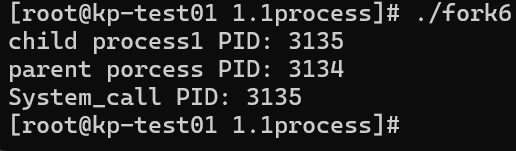  
由输出可知，紫禁城剩余部分被父进程覆盖，执行了与父进程不同的函数体。  
### 2.2 线程
#### 2.2.1 thread_race
采用库`pthread.h`中的函数，在同一个进程中创建了两个线程`thread1`和`thread2`，对其进行初始化，设置一个共享变量，并在两个线程中对该共享变量做相同操作，观察最终输出。核心代码块如下：  
```C  
// thread_race.c

#include <stdio.h>
#include <sys/types.h>
#include <sys/syscall.h>
#include <wait.h>
#include <stdlib.h>
#include <unistd.h>
#include <pthread.h>
#include <semaphore.h>
#define N 100000

int value = 0;

void *runner1(void *param);
void *runner2(void *param);

int main()
{
    pthread_t tid1, tid2;
    pthread_attr_t attr1, attr2;

    pthread_attr_init(&attr1);
    pthread_attr_init(&attr2);

    pthread_create(&tid1, &attr1, runner1, NULL);
    pthread_create(&tid2, &attr2, runner2, NULL);

    pthread_join(tid1,NULL);
    pthread_join(tid2, NULL);

    printf("value = %d\n", value);
}

void *runner1(void *param)
{
    printf("thread1 create success!\n");

    for (int i = 0; i < N; i++) {
        value += 2;
    }
}

void *runner2(void *param)
{
    printf("thread2 create success!\n");

    for (int i = 0; i < N; i++) {
        value -= 2;
    }
}  
```  
在两个线程中，各循环10000次，对共享变量`value`分别进行加2和减2操作。由于**对共享变量的操作是互斥的**，即同一时间只能有一个线程对一个变量进行读写操作，而编写的程序中**没有等待机制**，所以两个线程中的一些操作会被**随机丢弃**，导致最终**输出结果随机**。  
输出结果如下：  
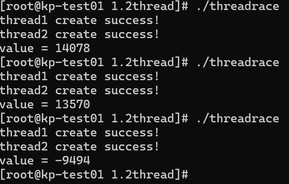  
对`threadrace`文件的三次执行输出了三个不同的结果，这与之前编写程序时的分析是一致的。  
#### 2.2.2 mutual_exclusion
本段代码引入一个**互斥锁**`mutex`，由库函数实现对共享变量的互斥读写操作。共享资源被创立时，初始化一个锁变量并与之关联。在操作一个共享资源前，应**先申请互斥锁**。**如果资源已被其他线程上锁**，则库函数将该线程加入该锁的等待队列，当该锁被其他线程释放时，系统会从等待队列中释放一个线程，使其就绪；**如果资源未被上锁**，则当前线程通过库函数给该资源上锁，并操作，当操作结束后，再通过库函数释放该锁，以便资源被其他线程使用。共享资源结束使用后，调用函数摧毁锁变量。  
核心代码如下：
```C  
// mutual_exclusion.c

#include <stdio.h>
#include <sys/types.h>
#include <sys/syscall.h>
#include <wait.h>
#include <stdlib.h>
#include <unistd.h>
#include <pthread.h>
#include <semaphore.h>
#define N 100000

int value = 0;
sem_t mutex; 
void *runner1(void *param);
void *runner2(void *param);

int main()
{
    pthread_t tid1, tid2;
    pthread_attr_t attr1, attr2;

    pthread_attr_init(&attr1);
    pthread_attr_init(&attr2);

    sem_init(&mutex, 0, 1);

    pthread_create(&tid1, &attr1, runner1, NULL);
    pthread_create(&tid2, &attr2, runner2, NULL);

    pthread_join(tid1,NULL);
    pthread_join(tid2, NULL);
      
    sem_destroy(&mutex);

    printf("value = %d\n", value);
}

void *runner1(void *param)
{
    printf("thread1 create success!\n");

    for (int i = 0; i < N; i++) {
        sem_wait(&mutex);
        value += 2;
        sem_post(&mutex);
    }    
}

void *runner2(void *param)
{
    printf("thread2 create success!\n");

    for (int i = 0; i < N; i++) {
        sem_wait(&mutex); 
        value -= 2;
        sem_post(&mutex);
    }
}
```  
由代码可知，在对`value`操作前，通过函数`sem_wait()`等待锁；在操作完成后，通过函数`sem_post`释放锁。  
输出结果如下：  
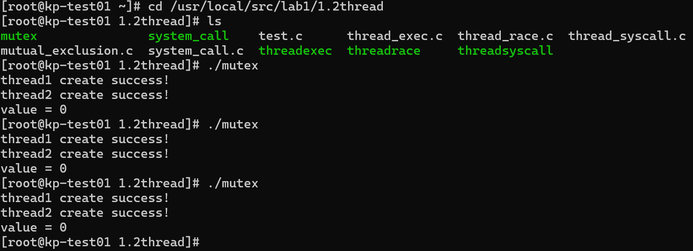  
多次执行代码可知，输出结果相同，为所需结果0，这说明两个线程对共享资源的读写操作实现了互斥，并实现了等待机制。  
#### 2.2.3 thread_syscall
通过调用系统调用，创建了一个新的进程，并使用`system_call.c`文件作为新进程的代码段。核心代码如下：  
```C
#include <stdio.h>
#include <sys/types.h>
#include <sys/syscall.h>
#include <wait.h>
#include <stdlib.h>
#include <unistd.h>
#include <pthread.h>
#include <semaphore.h>
#define N 100000

pid_t gettid();
void *runner1(void *param);
void *runner2(void *param);

int main()
{
    pthread_t tid1, tid2;
    pthread_attr_t attr1, attr2;

    pthread_attr_init(&attr1);
    pthread_attr_init(&attr2);


    pthread_create(&tid1, &attr1, runner1, NULL);
    pthread_create(&tid2, &attr2, runner2, NULL);

    pthread_join(tid1,NULL);
    pthread_join(tid2, NULL);

}

void *runner1(void *param)
{
    printf("thread1 create success!\n");
    
    pid_t pid = getpid();
    pthread_t tid = gettid();
    printf("thread1 tid = %ld ,pid = %d\n",tid, pid);

    printf("thread1 to use systemcall.\n");
    int sys_result = system("./system_call");
    if (sys_result == -1){
        perror("system");
    }
}

void *runner2(void *param)
{
    printf("thread2 create success!\n");

    pid_t pid = getpid();
    pthread_t tid = gettid();
    printf("thread2 tid = %ld ,pid = %d\n",tid, pid);

    printf("thread2 to use systemcall.\n");
    int sys_result = system("./system_call");
    if (sys_result == -1){
        perror("system");
    }
}

pid_t gettid()
{
    return syscall(SYS_gettid);
}

```  
预计的执行结果应为执行`system_call`文件。输出结果如下：  
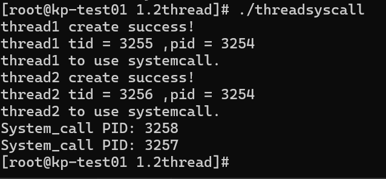  
在两个线程中分别调用系统调用，用`system_call`，创建了一个新的进程，输出了线程所属的进程标识，输出的两次进程标识是不同的，因为`system()`系统调用创建一个新的进程，执行内容为`system_call`的内容。  
#### 2.2.4 thread_exec
调用了`exec()`族函数，使用`system_call`覆盖当前进程之后执行的部分。  
核心代码如下：  
```C  
#include <stdio.h>
#include <sys/types.h>
#include <sys/syscall.h>
#include <wait.h>
#include <stdlib.h>
#include <unistd.h>
#include <pthread.h>
#include <semaphore.h>
#define N 100000

pid_t gettid();
void *runner1(void *param);
void *runner2(void *param);

int main()
{
    pthread_t tid1, tid2;
    pthread_attr_t attr1, attr2;

    pthread_attr_init(&attr1);
    pthread_attr_init(&attr2);


    pthread_create(&tid1, &attr1, runner1, NULL);
    pthread_create(&tid2, &attr2, runner2, NULL);

    pthread_join(tid1, NULL);
    pthread_join(tid2, NULL);

}

void *runner1(void *param)
{
    printf("thread1 create success!\n");

    pid_t pid = getpid();
    pthread_t tid = gettid();
    printf("thread1 tid = %ld ,pid = %d\n",tid, pid);

    printf("thread1 to use exec().\n");
    execlp("./system_call", "system_call", NULL);
    perror("exec");
    exit(1);
}

void *runner2(void *param)
{
    printf("thread2 create success!\n");

    pid_t pid = getpid();
    pthread_t tid = gettid();
    printf("thread2 tid = %ld ,pid = %d\n",tid, pid);

    printf("thread2 to use exec().\n");
    execlp("./system_call", "system_call", NULL);
    perror("exec");
    exit(1);
}

pid_t gettid()
{
    return syscall(SYS_gettid);
}

``` 
输出结果如下：  
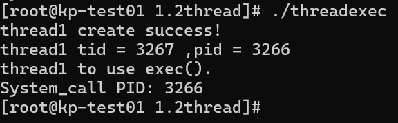  
图中只输出了一个进程标识，这是因为`exec()`**函数不创建新的进程，只是单纯地用指定的文件覆盖当前进程余下的所有内容**。因此，`thread2`**甚至根本就没来得及创建，就被`system_call`覆盖掉了！**  
### 2.3 自旋锁
这部分实验实现了一个自旋锁。实现了以下功能：  
1. 定义了自旋锁数据结构，如下：
```C  
typedef struct 
{
    int flag;
} spinlock_t;
```
2. 实现了自旋锁初始化方法，如下：  
```C
void spinlock_init(spinlock_t *lock) 
{
    lock->flag = 0;
}  
```  
3. 实现了自旋锁的获取（内含自旋等待）和释放，如下：
```C
void spinlock_lock(spinlock_t *lock) 
{
    while (__sync_lock_test_and_set(&lock->flag, 1)) {
    // 自旋等待
    }
}

void spinlock_unlock(spinlock_t *lock) 
{
    __sync_lock_release(&lock->flag);
}
```  
4. 在同一个进程中创建了两个线程和一个共享变量，在两个线程中对共享变量进行不同读写操作，操作之前获取锁，操作之后释放锁。完整代码如下：  
```C  
#include <stdio.h>
#include <pthread.h>

/*定义自旋锁数据结构*/
typedef struct 
{
    int flag;
} spinlock_t;

/*初始化*/
void spinlock_init(spinlock_t *lock) 
{
    lock->flag = 0;
}

/*获取自旋锁*/
void spinlock_lock(spinlock_t *lock) 
{
    while (__sync_lock_test_and_set(&lock->flag, 1)) {
    // 自旋等待
    }
}

/*释放自旋锁*/
void spinlock_unlock(spinlock_t *lock) 
{
    __sync_lock_release(&lock->flag);
}

int shared_value = 0;

void *thread_function1(void *arg) 
{
    spinlock_t *lock = (spinlock_t *)arg;
    for (int i = 0; i < 5000; ++i) {
        spinlock_lock(lock);
        shared_value += 2;
        if(i == 1500) printf("中间值：%d\n",shared_value);
        spinlock_unlock(lock);
    }
    return NULL;
}

void *thread_function2(void *arg) 
{
    spinlock_t *lock = (spinlock_t *)arg;
    for (int i = 0; i < 5000; ++i) {
        spinlock_lock(lock);
        shared_value -= 2;
        spinlock_unlock(lock);
    }
    return NULL;
}

int main() 
{
    /*创建两个线程*/
    pthread_t thread1, thread2;
    
    /*初始化一个自旋锁*/
    spinlock_t lock;

    printf("Shared_value: %d\n",shared_value);

    /*初始化自旋锁*/
    spinlock_init(&lock);

    if (pthread_create(&thread1, NULL, thread_function1, &lock) != 0)
    {
        perror("pthread_create");
        return 1;
    }
    if (pthread_create(&thread2, NULL, thread_function2, &lock) != 0) 
    {
        perror("pthread_create");
        return 1;
    }

    /*等待线程结束*/
    pthread_join(thread1, NULL);
    pthread_join(thread2, NULL);

    /*输出共享变量*/
    printf("Shared_value: %d\n",shared_value);
    return 0;
}
```  
预期输出结果为:  
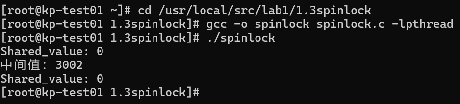  
输出结果正确，进行了5000次+2和5000次-2操作，最终结果为0；中间结果不为0。互斥正确，自旋等待正确。