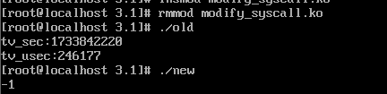
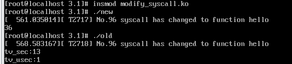

# 实验三 Linux动态模块与设备驱动
## 1.实验概述
实验分为两个部分。第一部分为Linux内核动态模块加载，即使用Linux提供的动态模块加载机制，将系统调用`gettimeofday()`替换为`hello()`；第二部分为Linux设备驱动，即编写一个简单的字符驱动程序，以内核空间模拟字符设备，完成了对该设备的打开，读写和释放操作。  
## 2.代码分析
### 2.1 Linux动态模块部分
代码分为四部分，即`modify_syscall.c`(用于修改系统调用),`modify_old_syscall.c``modiify_new_syscall.c`(用于测试用户程序),`Makefile`(用于编译内核模块)。  
#### 2.1.1 `modify_syscall.c`
为了hook系统调用，应当首先获得系统调用函数的地址。用户通过`syscall()`函数和特定的系统调用号来进行系统调用。在x86_64环境的虚拟机中，`gettimeofday()`系统调用号为96，其地址存储在系统调用表`sys_call_table`中，应当先设法获取调用表的地址，再通过计算获取所需函数的地址。获取系统调用表采用系统内置函数`kallsyms_lookup_name()`,但在Linux5.7版本之后，该符号不再导出，无法直接使用。所以，先通过`kprobe`方法，封装成函数`generic_kallsyms_lookup_name()`,并以此代替函数`kallsyms_lookup_name`查找系统调用表的地址。
避开`kallsyms_lookup_name()`的方法如下：
```C
#if LINUX_VERSION_CODE >= KERNEL_VERSION(5, 7, 0) || LINUX_VERSION_CODE < KERNEL_VERSION(2, 6, 33)


static unsigned long (*kallsyms_lookup_name_sym)(const char *name);

static int _kallsyms_lookup_kprobe(struct kprobe *p, struct pt_regs *regs)
{
        return 0;
}

unsigned long get_kallsyms_func(void)
{
        struct kprobe probe;
        int ret;
        unsigned long addr;

        memset(&probe, 0, sizeof(probe));
        probe.pre_handler = _kallsyms_lookup_kprobe;
        probe.symbol_name = "kallsyms_lookup_name";
        ret = register_kprobe(&probe);
        if (ret)
                return 0;
        addr = (unsigned long)probe.addr;
        unregister_kprobe(&probe);
        return addr;
}

unsigned long generic_kallsyms_lookup_name(const char *name)
{
        /* singleton */
        if (!kallsyms_lookup_name_sym) {
                kallsyms_lookup_name_sym = (void *)get_kallsyms_func();
                if(!kallsyms_lookup_name_sym)
                        return 0;
        }
        return kallsyms_lookup_name_sym(name);
}

#else

unsigned long generic_kallsyms_lookup_name(const char *name)
{
    return kallsyms_lookup_name(name);
}

#endif
```  
在这之后，只需要用新的查找方法，查找系统调用表的地址即可：
```C
void modify_syscall(void)
{
	unsigned long *sys_call_addr;
	p_sys_call_table = (unsigned long )generic_kallsyms_lookup_name("sys_call_table");
	if (!p_sys_call_table) {
        pr_err("Failed to find sys_call_table address\n");
        return;
    	}
        
    sys_call_addr = (unsigned long *)(p_sys_call_table + sys_No * sizeof(void *));
    old_sys_call_func = *(sys_call_addr);
	orig_cr0 = clear_cr0(); 
    *(sys_call_addr) = (unsigned long)&hello; // point to new function
    setback_cr0(orig_cr0);
}

void restore_syscall(void)
{
    unsigned long *sys_call_addr;

    sys_call_addr = (unsigned long *)(p_sys_call_table + sys_No * sizeof(void *));
	orig_cr0 = clear_cr0();
    *(sys_call_addr) = old_sys_call_func; // point to original function
    setback_cr0(orig_cr0);
}
```
通过系统调用表获取`gettimeofday()`的地址后，应当改写cr0寄存器，以此取消对内核空间的写保护，之后将调用表的指针指向新的函数`hello()`.此时，系统调用已被篡改。在恢复时，应当将调用表中指针指回旧的系统调用函数`gettimeofday()`,并将写保护位cr0恢复。修改系统保护位的方法如下：  
```C
unsigned int clear_cr0(void)        
{
        unsigned int cr0 = 0;
        unsigned int ret;
        //move the value in reg cr0 to reg rax        
        asm volatile ("movq %%cr0, %%rax" : "=a"(cr0));        
        ret = cr0;      
        cr0 &= 0xfffeffff; //set 0 to the 17th bit   
        asm volatile ("movq %%rax, %%cr0" :: "a"(cr0));        
        return ret;
}

//recover the value of WP 
void setback_cr0(unsigned int val)
{        
        asm volatile ("movq %%rax, %%cr0" :: "a"(val));
}
```
在向新的系统调用传参的过程中，指导书给的方法是采用`asmlinkage`标识，使得系统不从寄存器而是从函数栈上读取参数。对此查阅资料得知，在32位的x86中，系统将参数直接写到堆栈上，但在x64系统中，为了内核读写的速度，直接采用寄存器传参，而不采用堆栈传参（省去了一次内存写和一次内存读的时间）。所以如果仍旧采用`asmlinkage`标识，则会输出错误的值。因此，修改`hello()`函数代码如下：  
```C
int hello(const struct pt_regs *regs) //new function
{
    printk(KERN_ALERT"No.96 syscall has changed to function hello\n");
    int a = 0;
    int b = 0;
    a = regs->di;
    b = regs->si;
    return a+b;
}
```
采用了`const struct pt_regs`类型变量，直接用寄存器传参，从而得到正确的参数值。  

完整的代码如下：
```C

// modify_syscall.c

#include <linux/init.h>
#include <linux/kernel.h>
#include <linux/module.h>
#include <linux/kallsyms.h>
#include <linux/kprobes.h>
#include <linux/version.h>

//original,syscall 96 function: gettimeofday
// new syscall 96 function: print "No 96 syscall has changed to hello"and return a+b

#define sys_No 96
unsigned long old_sys_call_func;
unsigned long p_sys_call_table; // find in /boot/System.map-'uname -r'
unsigned long orig_cr0;


// *************************************************************************************************************

#if LINUX_VERSION_CODE >= KERNEL_VERSION(5, 7, 0) || LINUX_VERSION_CODE < KERNEL_VERSION(2, 6, 33)


static unsigned long (*kallsyms_lookup_name_sym)(const char *name);

static int _kallsyms_lookup_kprobe(struct kprobe *p, struct pt_regs *regs)
{
        return 0;
}

unsigned long get_kallsyms_func(void)
{
        struct kprobe probe;
        int ret;
        unsigned long addr;

        memset(&probe, 0, sizeof(probe));
        probe.pre_handler = _kallsyms_lookup_kprobe;
        probe.symbol_name = "kallsyms_lookup_name";
        ret = register_kprobe(&probe);
        if (ret)
                return 0;
        addr = (unsigned long)probe.addr;
        unregister_kprobe(&probe);
        return addr;
}

unsigned long generic_kallsyms_lookup_name(const char *name)
{
        /* singleton */
        if (!kallsyms_lookup_name_sym) {
                kallsyms_lookup_name_sym = (void *)get_kallsyms_func();
                if(!kallsyms_lookup_name_sym)
                        return 0;
        }
        return kallsyms_lookup_name_sym(name);
}

#else

unsigned long generic_kallsyms_lookup_name(const char *name)
{
    return kallsyms_lookup_name(name);
}

#endif

// ****************************************************************************************

unsigned int clear_cr0(void)        
{
        unsigned int cr0 = 0;
        unsigned int ret;
        //move the value in reg cr0 to reg rax
        //movl moves a 32-bits operand
        //movq moves a 64-bits operand
        //rax is a 64-bits register
        //an assembly language code
        //asm volatile ("movl %%cr0, %%eax" : "=a"(cr0));//32-bits        
        asm volatile ("movq %%cr0, %%rax" : "=a"(cr0));        //64-bits
        ret = cr0;
        //var cr0 is rax        
        cr0 &= 0xfffeffff; //set 0 to the 17th bit
        //asm volatile ("movl %%eax, %%cr0" :: "a"(cr0));//32-bits
        //note that cr0 above is a variable while cr0 below is a reg.        
        asm volatile ("movq %%rax, %%cr0" :: "a"(cr0));        
        return ret;
}

//recover the value of WP 
void setback_cr0(unsigned int val)
{        
        //asm volatile ("movl %%eax, %%cr0" :: "a"(val));//32-bits
        asm volatile ("movq %%rax, %%cr0" :: "a"(val));//64-bits
}

int hello(const struct pt_regs *regs) //new function
{
    printk(KERN_ALERT"No.96 syscall has changed to function hello\n");
    int a = 0;
    int b = 0;
    a = regs->di;
    b = regs->si;
    return a+b;
}

void modify_syscall(void)
{
	unsigned long *sys_call_addr;
	p_sys_call_table = (unsigned long )generic_kallsyms_lookup_name("sys_call_table");
	if (!p_sys_call_table) {
        pr_err("Failed to find sys_call_table address\n");
        return;
    	}
        
    sys_call_addr = (unsigned long *)(p_sys_call_table + sys_No * sizeof(void *));
    old_sys_call_func = *(sys_call_addr);
	orig_cr0 = clear_cr0(); 
    *(sys_call_addr) = (unsigned long)&hello; // point to new function
    setback_cr0(orig_cr0);
}

void restore_syscall(void)
{
    unsigned long *sys_call_addr;

    sys_call_addr = (unsigned long *)(p_sys_call_table + sys_No * sizeof(void *));
	orig_cr0 = clear_cr0();
    *(sys_call_addr) = old_sys_call_func; // point to original function
setback_cr0(orig_cr0);
}

static int mymodule_init(void)
{
    modify_syscall();
    return 0;
}

static void mymodule_exit(void)
{
    restore_syscall();
}


module_init(mymodule_init);
module_exit(mymodule_exit);
MODULE_LICENSE("GPL");

```  

#### 2.1.2 其他三部分代码
`modify_old_syscall.c`和`modify_new_syscall.c`代码都是用和测试程序。在加载模块后，执行这两部分代码，通过输出可以知道系统调用已经被篡改。  
`Makefile`文件规定了编译规则。采用
```
CONFIG_MODULE_SIG=n
```
给予权限，采用
```
obj-m := modify_syscall.o # 编译成外部模块
```
将`modify_syscall.c`编译成外部模块`modify_syscall.ko`以便加载进内核。
此三部分的源代码如下：
```C

// modify_old_syscall.c

#include<stdio.h>
#include<sys/time.h>
#include<unistd.h>

int main()
{
    struct timeval tv;
    syscall(96, &tv, NULL); // before modify syscall 96 :gettimeofday
    printf("tv_sec:%d\n", tv.tv_sec);
    printf("tv_usec:%d\n", tv.tv_usec);
    return 0;
} 

```

```C

// modify_new_syscall.c

#include<stdio.h> 
#include<sys/time.h> 
#include<unistd.h> 
int main() 
{ 
 int ret=syscall(78,10,20); //after modify syscall 78 
 printf("%d\n",ret); 
 return 0; 
} 

```

```

# Makefile

CONFIG_MODULE_SIG=n
ifneq ($(KERNELRELEASE),)
obj-m := modify_syscall.o # 编译成外部模块
else
KERNELDIR := /lib/modules/$(shell uname -r)/build # 定义一个变量，指向内核目录
PWD := $(shell pwd)

modules:
	$(MAKE) -C $(KERNELDIR) M=$(PWD) modules # 编译内核模块

clean:
	$(MAKE) -C $(KERNELDIR) M=$(PWD) clean # 清理编译产生的文件
	rm -f modify_old_syscall modify_new_syscall

all : modify_old_syscall modify_new_syscall 
.PHONY : all
modify_old_syscall: modify_old_syscall.c
	gcc -o $@ $<
modify_new_syscall: modify_new_syscall.c
	gcc -o $@ $<

	
endif

```
  
#### 2.1.3 运行结果
加载模块前，运行结果如下：  

`old`执行结果位系统调用`gettimeofday()`的结果,即自1970年以来经过的秒数；   
`mew`执行结果为-1，因为此时系统调用还未被篡改，系统调用返回-1。  
  
  
使用命令
```
insmod modify_syscall.ko
```
加载模块之后，运行结果如下：  

`new`执行的结果为36，这是因为在`modify_new_syscall.c`中，向函数传递的参数为10和26，函数`hello()`返回了两个参数的和；  
`old`执行的结果为随机结果，此时系统调用已经被篡改，无法正常返回系统时间。  
  

### 2.2 Linux设备驱动部分
代码分为三部分：`Makefile`规定了文件的编译规则；`chardev_drive.c`是字符设备的驱动程序，编译成外部模块并加载进入内核；`test_char_device.c`是用户程序。
#### 2.2.1 `chardev_drive.c`  
```C
#include <linux/init.h>        // 包含模块初始化和清理函数的定义
#include <linux/module.h>      // 包含加载模块时需要的函数和符号定义
#include <linux/fs.h>
#include <linux/sched.h>
#include <asm/uaccess.h>
#include <linux/init_task.h>
#include <linux/unistd.h>
#include <linux/kernel.h>
#include <linux/string.h>
#include <linux/wait.h>
#include <linux/semaphore.h>
#include <linux/cdev.h>
#include <linux/device.h>
#include <linux/types.h>
#include <linux/kdev_t.h>

MODULE_LICENSE("GPL");

#define MAJOR_NUM 400          // 主设备号
#define MAXNUM 100             // 缓冲区大小

static ssize_t globalvar_read(struct file *, char *, size_t, loff_t*);
static ssize_t globalvar_write(struct file *, const char *, size_t, loff_t*);

// 文件操作结构体
struct file_operations globalvar_fops = {
    .read = globalvar_read,
    .write = globalvar_write,
};

// 自定义设备结构体
struct Scull_Dev {
    struct cdev devm;               // 字符设备
    struct semaphore sem;           // 信号量
    wait_queue_head_t outq;         // 等待队列
    int flag;                       // 阻塞唤醒标志
    char *read, *write, *end;       // 读，写，尾指针
    char buffer[MAXNUM + 1];        // 字符缓冲区
};

struct Scull_Dev globalvar;
static struct class *my_class;
int major = MAJOR_NUM;

// 模块初始化
static int init_mymodule(void) {
    int result = 0;
    int err = 0;
    dev_t dev = MKDEV(major, 0);    // 创建设备编号

    if (major) {
        result = register_chrdev_region(dev, 1, "ch_device");
    } else {
        result = alloc_chrdev_region(&dev, 0, 1, "ch_device");
        major = MAJOR(dev);
    }
    if (result < 0) return result;

    // 初始化字符设备
    cdev_init(&globalvar.devm, &globalvar_fops);
    globalvar.devm.owner = THIS_MODULE;
    err = cdev_add(&globalvar.devm, dev, 1);
    if (err) {
        printk("Error adding cdev\n");
        return err;
    } else {
        printk("ch_device register success\n");
        sema_init(&globalvar.sem, 1);            // 初始化信号量
        init_waitqueue_head(&globalvar.outq);   // 初始化等待队列
        globalvar.read = globalvar.buffer;
        globalvar.write = globalvar.buffer;
        globalvar.end = globalvar.buffer + MAXNUM;
        globalvar.flag = 0;                     // 阻塞唤醒标志置 0
    }

    // 创建设备文件 `/dev/ch_device`
    my_class = class_create(THIS_MODULE, "ch_device");
    device_create(my_class, NULL, dev, NULL, "ch_device");

    return 0;
}

// 模块卸载
static void cleanup_mymodule(void) {
    device_destroy(my_class, MKDEV(major, 0));
    class_destroy(my_class);
    cdev_del(&globalvar.devm);
    unregister_chrdev_region(MKDEV(major, 0), 1);
}

// 读操作实现
static ssize_t globalvar_read(struct file *filp, char *buf, size_t len, loff_t *off) {
    if (wait_event_interruptible(globalvar.outq, globalvar.flag != 0)) {
    	

        return -ERESTARTSYS;
    }

    if (down_interruptible(&globalvar.sem)) {
        return -ERESTARTSYS;  // 获取信号量失败
    }

    globalvar.flag = 0;
    printk("read!\n");
    printk("the read is %c\n",*globalvar.read);

    if (globalvar.read < globalvar.write) {
        len = min(len, (size_t)(globalvar.write - globalvar.read));
    } else {
        len = min(len, (size_t)(globalvar.end - globalvar.read));
    }
	printk("the len is %zu\n",len);
    if (copy_to_user(buf, globalvar.read, len)) {
    	printk("fail!\n");
        up(&globalvar.sem);
        return -EFAULT;
    }
	printk("read success!\n");
    globalvar.read += len;
    if (globalvar.read == globalvar.end) globalvar.read = globalvar.buffer;

    up(&globalvar.sem);
    return len;
}

// 写操作实现
static ssize_t globalvar_write(struct file *filp, const char *buf, size_t len, loff_t *off) {
    if (down_interruptible(&globalvar.sem)) {
        return -ERESTARTSYS;
    }

    if (globalvar.read <= globalvar.write) {
        len = min(len, (size_t)(globalvar.end - globalvar.write));
    } else {
        len = min(len, (size_t)(globalvar.read - globalvar.write - 1));
    }

    if (copy_from_user(globalvar.write, buf, len)) {
        up(&globalvar.sem);
        return -EFAULT;
    }
	printk("write success!\n");
    globalvar.write += len;
    if (globalvar.write == globalvar.end) globalvar.write = globalvar.buffer;

    up(&globalvar.sem);
    globalvar.flag = 1;
    wake_up_interruptible(&globalvar.outq);  // 唤醒阻塞的读进程
    return len;
}

module_init(init_mymodule);
module_exit(cleanup_mymodule);
```
#### 2.2.2 其他部分代码
```
# Makefile

CONFIG_MODULE_SIG=n
ifneq ($(KERNELRELEASE),)
obj-m := chardev_drive.o # 编译成外部模块
else
KERNELDIR := /lib/modules/$(shell uname -r)/build # 定义一个变量，指向内核目录
PWD := $(shell pwd)

modules:
	$(MAKE) -C $(KERNELDIR) M=$(PWD) modules # 编译内核模块

clean:
	$(MAKE) -C $(KERNELDIR) M=$(PWD) clean # 清理编译产生的文件

all : test
.PHONY : all
test: test_char_device.c
	gcc -o $@ $<

endif
```  
```C

// test_char_device.c  

#include <sys/types.h>
#include <sys/stat.h>
#include <stdio.h>
#include <fcntl.h>
#include <string.h>
#include <unistd.h> // read, write, close
#include <stdlib.h> // exit

int main()
{
    int fd;
    char num[101], temp;

    printf("1>write\n2>read\n");
    temp = getchar();
    getchar(); // 清除换行符

    if (temp == '2') { // 读
        fd = open("/dev/ch_device", O_RDWR, S_IRUSR | S_IWUSR); // 修改设备路径为 /dev/ch_device
        if (fd == -1) {
            perror("Device open failure");
            exit(EXIT_FAILURE);
        }

        printf("Reading from /dev/ch_device:\n");
        while (1) {
            memset(num, '\0', sizeof(num));
            int ret = read(fd, num, 100);
            
            if (ret < 0) {
                perror("Read failed");
                close(fd);
                exit(EXIT_FAILURE);
            } else if (ret == 0) {
                printf("No data to read\n");
                int waitingflag = 0;
                printf("Waiting for data or not?\nEnter 0 to wait, and other numbers to quit waiting.\n");
                scanf("%d", &waitingflag);
                if(!waitingflag) {
                    close(fd);
                    return 0;
                }
                continue; // 等待数据
            }
            num[ret] = '\0'; // 确保字符串以 '\0' 结尾

            printf("Read complete, as follows:\n%s\n", num);
            printf("Continue reading or not?\nEnter 1 to quit reading, and other numbers to continue.\n");
            int quitflag = 0;
            scanf("%d", &quitflag);
            if(quitflag == 1) break;
            else continue;
            // if (strcmp(num, "exit") == 0) {
            //     printf("Exiting read loop\n");
            //     break;
            // }
        }
        close(fd);

    } else if (temp == '1') { // 写
        fd = open("/dev/ch_device", O_RDWR, S_IRUSR | S_IWUSR); // 修改设备路径为 /dev/ch_device
        if (fd == -1) {
            perror("Device open failure");
            exit(EXIT_FAILURE);
        }

        printf("Writing to /dev/ch_device:\n");
        while (1) {
            printf("Please input message (type 'exit' to quit):\n");
            if (fgets(num, sizeof(num), stdin) == NULL) {
                perror("Input error");
                break;
            }
            num[strcspn(num, "\n")] = '\0'; // 去掉换行符

            int ret = write(fd, num, strlen(num));
            if (ret < 0) {
                perror("Write failed");
                close(fd);
                exit(EXIT_FAILURE);
            }

            if (strcmp(num, "exit") == 0) {
                printf("Exiting write loop\n");
                break;
            }
        }
        close(fd);

    } else {
        printf("Invalid option\n");
    }

    return 0;
}

```