西安交通大学
# <center>操作系统专题实验报告
<center>
班级：计算机2206  
</center>
<center> 
姓名：张鑫
</center>
<center>
学号：2221313218 
</center>
<center>
2024年12月16日
</center>
<div STYLE="page-break-after: always;"></div>

- [操作系统专题实验报告](#操作系统专题实验报告)
  - [实验一 进程、线程相关编程实验](#实验一-进程线程相关编程实验)
    - [1. 实验概述](#1-实验概述)
    - [2. 代码描述](#2-代码描述)
      - [2.1 进程](#21-进程)
        - [2.1.1 fork\_with\_wait](#211-fork_with_wait)
        - [2.1.2 fork\_WITHOUT\_wait](#212-fork_without_wait)
        - [2.1.3 fork\_GlobalVariable](#213-fork_globalvariable)
        - [2.1.4 fork\_BefornReturn](#214-fork_befornreturn)
        - [2.1.5 fork\_systemcall](#215-fork_systemcall)
        - [2.1.6 fork\_exec](#216-fork_exec)
      - [2.2 线程](#22-线程)
        - [2.2.1 thread\_race](#221-thread_race)
        - [2.2.2 mutual\_exclusion](#222-mutual_exclusion)
        - [2.2.3 thread\_syscall](#223-thread_syscall)
        - [2.2.4 thread\_exec](#224-thread_exec)
      - [2.3 自旋锁](#23-自旋锁)
    - [3.思考题](#3思考题)
  - [实验二 进程通信与内存管理](#实验二-进程通信与内存管理)
    - [1.实验概述](#1实验概述)
    - [2.代码描述](#2代码描述)
      - [2.1 进程的软中断通信](#21-进程的软中断通信)
      - [2.2 进程的管道通信](#22-进程的管道通信)
      - [2.3 内存分配与管理](#23-内存分配与管理)
    - [3.思考题](#3思考题-1)
      - [1. 对三个算法进行比较](#1-对三个算法进行比较)
      - [2. 内碎片、外碎片，紧缩功能解决的是什么碎片？](#2-内碎片外碎片紧缩功能解决的是什么碎片)
  - [实验三 Linux动态模块与设备驱动](#实验三-linux动态模块与设备驱动)
    - [1.实验概述](#1实验概述-1)
    - [2.代码分析](#2代码分析)
      - [2.1 Linux动态模块部分](#21-linux动态模块部分)
        - [2.1.1 `modify_syscall.c`](#211-modify_syscallc)
        - [2.1.2 其他三部分代码](#212-其他三部分代码)
        - [2.1.3 运行结果](#213-运行结果)
      - [2.2 Linux设备驱动部分](#22-linux设备驱动部分)
        - [2.2.1 `chardev_drive.c`](#221-chardev_drivec)
        - [2.2.2 其他部分代码](#222-其他部分代码)
<div STYLE="page-break-after: always;"></div>  

## 实验一 进程、线程相关编程实验

### 1. 实验概述

1.1中，`fork_with_wait.c`文件依次创建了父进程并在父进程中创建了子进程，并输出了父进程和子进程的进程标识；之后，在 `fork_WITHOUT_wait.c`文件中删去 `wait()`函数，观察父进程与子进程的执行顺序；再之后，在 `fork_GlobalVariable.c`和 `fork_BeforeReturn`中设置一个全局变量，并在父进程与子进程中对其进行不同的操作，观察创建子进程时，来自父进程的数据是如何被继承的；之后，在 `fork_syscall.c`和 `fork_exec.c`中分别调用 `system()`和 `exec()`族函数，试图用一个额外的文件 `system_call.c`覆盖子进程的代码块。
1.2中，`thread_race.c`文件在一个进程中创建两个线程 `thread1`和 `thread2`，设置同一个变量，进行不同操作并观察两个线程的竞争；之后，在 `mutual_exclusion.c`文件中定义了信号量并采用该互斥信号量实现了共享变量的互斥访问。之后，在 `thread_syscall.c`和 `thread_exec.c`中，分别采用系统调用方法和 `exec()`族函数，试图用 `system_call.c`文件覆盖线程的剩余部分，并输出线程的线程标识和进程标识。
1.3中，在 `spinlock.c`文件中实现了一个自旋锁，以此实现对共享变量的互斥访问和忙等待。

### 2. 代码描述

#### 2.1 进程

##### 2.1.1 fork_with_wait

用库函数实现父进程等待子进程，核心代码如下：

```C
int main()
{  
pid_t pid, pid1;
  
    /* fork a child process */
    pid = fork();

    if(pid < 0){ /* error occured */
        fprintf(stderr, "Fork Failed!");
        return 1;
    }
    else if(pid == 0){ /* child process */
        pid1 = getpid();
        printf("child: pid = %d", pid); //A, pid expected to be 0
        printf("child: pid1 = %d", pid1); //B, pid expected to be child's pid
    }
    else{/* parent process */
        pid1 = getpid();
        printf("parent: pid = %d", pid); //C, pid expected to be child's pid
        printf("parent: pid1 = %d", pid1); //D, pid1 expected to be parent's pid
        wait(NULL);//wait until child ends
    }

    return 0;
}
```

父进程将等待子进程结束后，才能继续执行 `wait()`函数后面的内容。
输出结果如下：
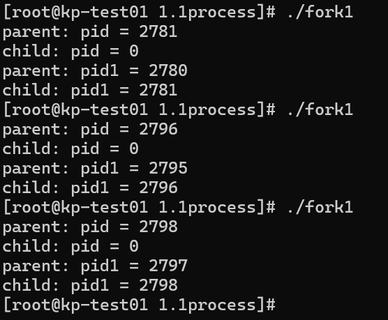  
`fork()`函数调用一次，返回两次，在父进程中返回子进程的pid，子进程中返回0. ABCD四处的返回如代码中注释。

##### 2.1.2 fork_WITHOUT_wait

去掉了父进程中的 `wait()`函数，核心代码如下：

```C
int main()
{  
pid_t pid, pid1;
  
    /* fork a child process */
    pid = fork();

    if(pid < 0){ /* error occured */
        fprintf(stderr, "Fork Failed!");
        return 1;
    }
    else if(pid == 0){ /* child process */
        pid1 = getpid();
        printf("child: pid = %d\n", pid); //A, pid expected to be 0
        printf("child: pid1 = %d\n", pid1); //B, pid expected to be child's pid
    }
    else{/* parent process */
        pid1 = getpid();
        printf("parent: pid = %d\n", pid); //C, pid expected to be child's pid
        printf("parent: pid1 = %d\n", pid1); //D, pid1 expected to be parent's pid
        // wait(NULL);
    }

    return 0;
}
```

父进程无需等待子进程的终止即可终止。运行结果如下：
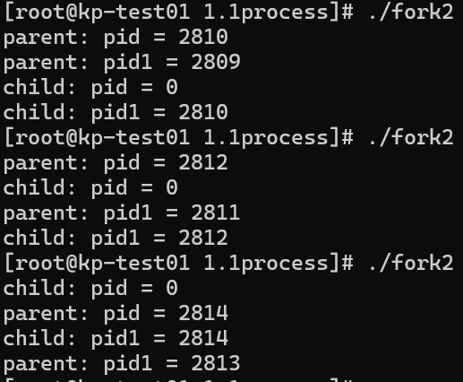  
对返回值的分析应与去掉 `wait()`函数前一致，不加赘述。

##### 2.1.3 fork_GlobalVariable

设置一个全局变量

```C
int global_value;
```

以供父进程和子进程执行不同操作。核心代码如下：

```C
......
    else if(pid == 0){ /* child process */
        pid1 = getpid();
        global_value--;
        /*
        printf("child: pid = %d/n", pid); //A, pid expected to be 0
        printf("child: pid1 = %d/n", pid1); //B, pid expected to be child's pid
         */
        printf("child: value = %d\n", global_value);
    }
    else{/* parent process */
        pid1 = getpid();
        global_value++;
        /*
        printf("parent: pid = %d/n", pid); //C, pid expected to be child's pid
        printf("parent: pid1 = %d/n", pid1); //D, pid1 expected to be parent's pid
        wait(NULL);  //wait until child ends
         */
        printf("parent: value = %d\n", global_value);
    }
......
```

在子进程中，对全局变量自减1；在父进程中，对全局变量自加1.输出结果如下：
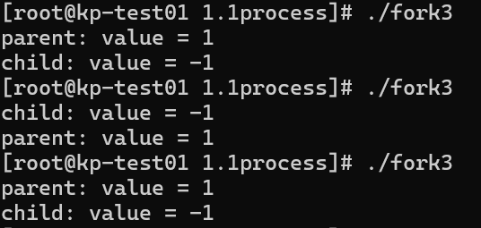   
由输出结果发现，父进程和子进程输出的全局变量的值**并不相同**。
假设它们共享同一份数据空间，则应当享有相同的全局变量的值，输出也应当相同。这种假设与实际输出结果不符。
对该现象的一种合理解释是，**子进程在被创建时自动地继承父进程的数据空间的一份副本**。即，子进程的数据空间是独立于父进程的，但子进程的数据在内容上时父进程的拷贝。这样，在父进程和子进程中分别做不同的操作，最终输出的值也不相同。

##### 2.1.4 fork_BefornReturn

在上一步基础上，在 `return`前增加对全局变量的操作。核心代码块如下：

```C
    ......

    else if(pid == 0){ /* child process */
        pid1 = getpid();
        global_value--;
        /*
        printf("child: pid = %d/n", pid); //A, pid expected to be 0
        printf("child: pid1 = %d/n", pid1); //B, pid expected to be child's pid
         */
        printf("child: value  = %d\n", global_value);
        printf("child: &value = %d\n", &global_value);
    }
    else{/* parent process */
        pid1 = getpid();
        global_value++;
        /*
        printf("parent: pid = %d/n", pid); //C, pid expected to be child's pid
        printf("parent: pid1 = %d/n", pid1); //D, pid1 expected to be parent's pid
        wait(NULL);  //wait until child ends
         */
        printf("parent: value  = %d\n", global_value);
        printf("parent: &value = %d\n", &global_value);
    }

    global_value = global_value + 10;
    printf("global_variable = %d\n", global_value);

    return 0;

    ......

```

增加操作为全局变量自加10

```C
global_value = global_value + 10;
```

输出结果如下：
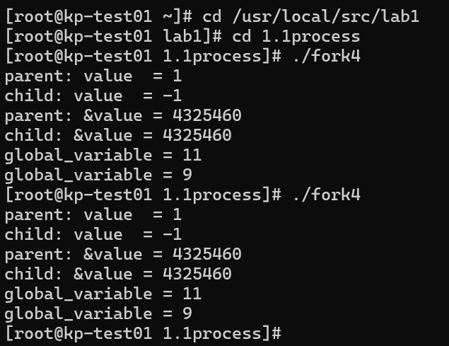  
从输出结果来看，两个进程输出的 `value`**值并不相同**，这印证了刚才的分析，即创建子进程时，数据并不共享，子进程继承一份父进程数据空间的拷贝；两个进程输出的 `&value`**相同**，即地址空间相同。这里输出的地址空间是**虚拟内存地址**（定义变量时，系统分配的虚拟内存地址），映射到物理内存时，并不会映射到同一片空间。

##### 2.1.5 fork_systemcall

通过系统调用，用文件 `system_call.c`的代码段作为子进程的代码段，核心代码如下：

```C
    ......
  
    else if(pid == 0){ /* child process */
        pid1 = getpid();
        if(system("./system_call") == -1)
            perror("system_call");
        printf("child process PID: %d\n", pid1);
    }
    else{/* parent process */
        pid1 = getpid();
        printf("child process1 PID: %d\n", pid);
        printf("parent porcess PID: %d\n", pid1);
        wait(NULL);//wait until child ends
    }

    ......

```

在子进程中调用系统调用 `system()`，创建一个新进程，并使用 `system_call`文件作为新进程的代码段，以此实现让父进程和子进程实现不同的操作。输出结果如下：
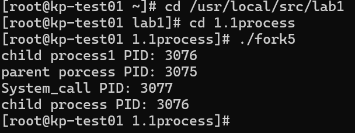  
由输出可知，子进程的剩余部分被系统调用覆盖，执行了与父进程不同的函数体。

##### 2.1.6 fork_exec

通过 `exec()`族函数，用 `system_call.c`文件覆盖子进程剩余部分代码。核心代码块如下：

```C
    ......

    else if(pid == 0){ /* child process */
        execlp("./system_call", "system_call", NULL);
        /* If execlp() failed, the following child process will NOT be covered and will be executed to tell an error */
        perror("exec");
        exit(1);
    }
    else{/* parent process */
        pid1 = getpid();
        printf("child process1 PID: %d\n", pid);
        printf("parent porcess PID: %d\n", pid1);
        wait(NULL);//wait until child ends
    }

    ......
```

在子进程中调用函数 `execlp()`，使用预先编译好的 `system_call`文件代码覆盖子进程之后的内容，以此实现让父进程和子进程实现不同的操作。输出结果如下：
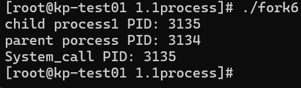  
由输出可知，紫禁城剩余部分被父进程覆盖，执行了与父进程不同的函数体。

#### 2.2 线程

##### 2.2.1 thread_race

采用库 `pthread.h`中的函数，在同一个进程中创建了两个线程 `thread1`和 `thread2`，对其进行初始化，设置一个共享变量，并在两个线程中对该共享变量做相同操作，观察最终输出。核心代码块如下：

```C
// thread_race.c

#include <stdio.h>
#include <sys/types.h>
#include <sys/syscall.h>
#include <wait.h>
#include <stdlib.h>
#include <unistd.h>
#include <pthread.h>
#include <semaphore.h>
#define N 100000

int value = 0;

void *runner1(void *param);
void *runner2(void *param);

int main()
{
    pthread_t tid1, tid2;
    pthread_attr_t attr1, attr2;

    pthread_attr_init(&attr1);
    pthread_attr_init(&attr2);

    pthread_create(&tid1, &attr1, runner1, NULL);
    pthread_create(&tid2, &attr2, runner2, NULL);

    pthread_join(tid1,NULL);
    pthread_join(tid2, NULL);

    printf("value = %d\n", value);
}

void *runner1(void *param)
{
    printf("thread1 create success!\n");

    for (int i = 0; i < N; i++) {
        value += 2;
    }
}

void *runner2(void *param)
{
    printf("thread2 create success!\n");

    for (int i = 0; i < N; i++) {
        value -= 2;
    }
}  
```

在两个线程中，各循环10000次，对共享变量 `value`分别进行加2和减2操作。由于**对共享变量的操作是互斥的**，即同一时间只能有一个线程对一个变量进行读写操作，而编写的程序中**没有等待机制**，所以两个线程中的一些操作会被**随机丢弃**，导致最终**输出结果随机**。
输出结果如下：
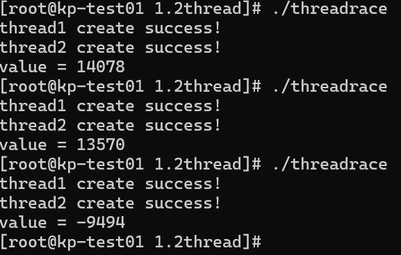  
对 `threadrace`文件的三次执行输出了三个不同的结果，这与之前编写程序时的分析是一致的。

##### 2.2.2 mutual_exclusion

本段代码引入一个**互斥锁** `mutex`，由库函数实现对共享变量的互斥读写操作。共享资源被创立时，初始化一个锁变量并与之关联。在操作一个共享资源前，应**先申请互斥锁**。**如果资源已被其他线程上锁**，则库函数将该线程加入该锁的等待队列，当该锁被其他线程释放时，系统会从等待队列中释放一个线程，使其就绪；**如果资源未被上锁**，则当前线程通过库函数给该资源上锁，并操作，当操作结束后，再通过库函数释放该锁，以便资源被其他线程使用。共享资源结束使用后，调用函数摧毁锁变量。
核心代码如下：

```C
// mutual_exclusion.c

#include <stdio.h>
#include <sys/types.h>
#include <sys/syscall.h>
#include <wait.h>
#include <stdlib.h>
#include <unistd.h>
#include <pthread.h>
#include <semaphore.h>
#define N 100000

int value = 0;
sem_t mutex; 
void *runner1(void *param);
void *runner2(void *param);

int main()
{
    pthread_t tid1, tid2;
    pthread_attr_t attr1, attr2;

    pthread_attr_init(&attr1);
    pthread_attr_init(&attr2);

    sem_init(&mutex, 0, 1);

    pthread_create(&tid1, &attr1, runner1, NULL);
    pthread_create(&tid2, &attr2, runner2, NULL);

    pthread_join(tid1,NULL);
    pthread_join(tid2, NULL);
    
    sem_destroy(&mutex);

    printf("value = %d\n", value);
}

void *runner1(void *param)
{
    printf("thread1 create success!\n");

    for (int i = 0; i < N; i++) {
        sem_wait(&mutex);
        value += 2;
        sem_post(&mutex);
    }  
}

void *runner2(void *param)
{
    printf("thread2 create success!\n");

    for (int i = 0; i < N; i++) {
        sem_wait(&mutex); 
        value -= 2;
        sem_post(&mutex);
    }
}
```

由代码可知，在对 `value`操作前，通过函数 `sem_wait()`等待锁；在操作完成后，通过函数 `sem_post`释放锁。
输出结果如下：
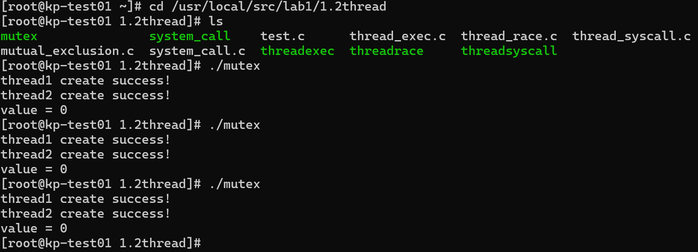  
多次执行代码可知，输出结果相同，为所需结果0，这说明两个线程对共享资源的读写操作实现了互斥，并实现了等待机制。

##### 2.2.3 thread_syscall

通过调用系统调用，创建了一个新的进程，并使用 `system_call.c`文件作为新进程的代码段。核心代码如下：

```C
#include <stdio.h>
#include <sys/types.h>
#include <sys/syscall.h>
#include <wait.h>
#include <stdlib.h>
#include <unistd.h>
#include <pthread.h>
#include <semaphore.h>
#define N 100000

pid_t gettid();
void *runner1(void *param);
void *runner2(void *param);

int main()
{
    pthread_t tid1, tid2;
    pthread_attr_t attr1, attr2;

    pthread_attr_init(&attr1);
    pthread_attr_init(&attr2);


    pthread_create(&tid1, &attr1, runner1, NULL);
    pthread_create(&tid2, &attr2, runner2, NULL);

    pthread_join(tid1,NULL);
    pthread_join(tid2, NULL);

}

void *runner1(void *param)
{
    printf("thread1 create success!\n");
  
    pid_t pid = getpid();
    pthread_t tid = gettid();
    printf("thread1 tid = %ld ,pid = %d\n",tid, pid);

    printf("thread1 to use systemcall.\n");
    int sys_result = system("./system_call");
    if (sys_result == -1){
        perror("system");
    }
}

void *runner2(void *param)
{
    printf("thread2 create success!\n");

    pid_t pid = getpid();
    pthread_t tid = gettid();
    printf("thread2 tid = %ld ,pid = %d\n",tid, pid);

    printf("thread2 to use systemcall.\n");
    int sys_result = system("./system_call");
    if (sys_result == -1){
        perror("system");
    }
}

pid_t gettid()
{
    return syscall(SYS_gettid);
}

```

预计的执行结果应为执行 `system_call`文件。输出结果如下：
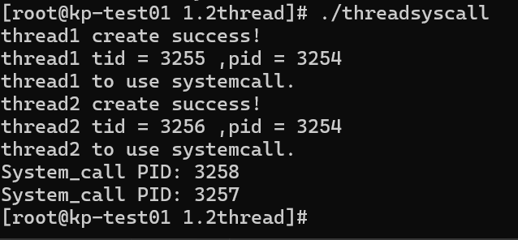  
在两个线程中分别调用系统调用，用 `system_call`，创建了一个新的进程，输出了线程所属的进程标识，输出的两次进程标识是不同的，因为 `system()`系统调用创建一个新的进程，执行内容为 `system_call`的内容。

##### 2.2.4 thread_exec

调用了 `exec()`族函数，使用 `system_call`覆盖当前进程之后执行的部分。
核心代码如下：

```C
#include <stdio.h>
#include <sys/types.h>
#include <sys/syscall.h>
#include <wait.h>
#include <stdlib.h>
#include <unistd.h>
#include <pthread.h>
#include <semaphore.h>
#define N 100000

pid_t gettid();
void *runner1(void *param);
void *runner2(void *param);

int main()
{
    pthread_t tid1, tid2;
    pthread_attr_t attr1, attr2;

    pthread_attr_init(&attr1);
    pthread_attr_init(&attr2);


    pthread_create(&tid1, &attr1, runner1, NULL);
    pthread_create(&tid2, &attr2, runner2, NULL);

    pthread_join(tid1, NULL);
    pthread_join(tid2, NULL);

}

void *runner1(void *param)
{
    printf("thread1 create success!\n");

    pid_t pid = getpid();
    pthread_t tid = gettid();
    printf("thread1 tid = %ld ,pid = %d\n",tid, pid);

    printf("thread1 to use exec().\n");
    execlp("./system_call", "system_call", NULL);
    perror("exec");
    exit(1);
}

void *runner2(void *param)
{
    printf("thread2 create success!\n");

    pid_t pid = getpid();
    pthread_t tid = gettid();
    printf("thread2 tid = %ld ,pid = %d\n",tid, pid);

    printf("thread2 to use exec().\n");
    execlp("./system_call", "system_call", NULL);
    perror("exec");
    exit(1);
}

pid_t gettid()
{
    return syscall(SYS_gettid);
}

```

输出结果如下：
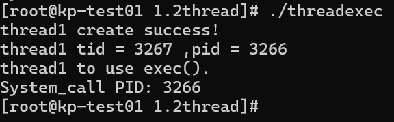  
图中只输出了一个进程标识，这是因为 `exec()`**函数不创建新的进程，只是单纯地用指定的文件覆盖当前进程余下的所有内容**。因此，`thread2`**甚至根本就没来得及创建，就被 `system_call`覆盖掉了！**

#### 2.3 自旋锁

这部分实验实现了一个自旋锁。实现了以下功能：

1. 定义了自旋锁数据结构，如下：

```C
typedef struct 
{
    int flag;
} spinlock_t;
```

2. 实现了自旋锁初始化方法，如下：

```C
void spinlock_init(spinlock_t *lock) 
{
    lock->flag = 0;
}  
```

3. 实现了自旋锁的获取（内含自旋等待）和释放，如下：

```C
void spinlock_lock(spinlock_t *lock) 
{
    while (__sync_lock_test_and_set(&lock->flag, 1)) {
    // 自旋等待
    }
}

void spinlock_unlock(spinlock_t *lock) 
{
    __sync_lock_release(&lock->flag);
}
```

4. 在同一个进程中创建了两个线程和一个共享变量，在两个线程中对共享变量进行不同读写操作，操作之前获取锁，操作之后释放锁。完整代码如下：

```C
#include <stdio.h>
#include <pthread.h>

/*定义自旋锁数据结构*/
typedef struct 
{
    int flag;
} spinlock_t;

/*初始化*/
void spinlock_init(spinlock_t *lock) 
{
    lock->flag = 0;
}

/*获取自旋锁*/
void spinlock_lock(spinlock_t *lock) 
{
    while (__sync_lock_test_and_set(&lock->flag, 1)) {
    // 自旋等待
    }
}

/*释放自旋锁*/
void spinlock_unlock(spinlock_t *lock) 
{
    __sync_lock_release(&lock->flag);
}

int shared_value = 0;

void *thread_function1(void *arg) 
{
    spinlock_t *lock = (spinlock_t *)arg;
    for (int i = 0; i < 5000; ++i) {
        spinlock_lock(lock);
        shared_value += 2;
        if(i == 1500) printf("中间值：%d\n",shared_value);
        spinlock_unlock(lock);
    }
    return NULL;
}

void *thread_function2(void *arg) 
{
    spinlock_t *lock = (spinlock_t *)arg;
    for (int i = 0; i < 5000; ++i) {
        spinlock_lock(lock);
        shared_value -= 2;
        spinlock_unlock(lock);
    }
    return NULL;
}

int main() 
{
    /*创建两个线程*/
    pthread_t thread1, thread2;
  
    /*初始化一个自旋锁*/
    spinlock_t lock;

    printf("Shared_value: %d\n",shared_value);

    /*初始化自旋锁*/
    spinlock_init(&lock);

    if (pthread_create(&thread1, NULL, thread_function1, &lock) != 0)
    {
        perror("pthread_create");
        return 1;
    }
    if (pthread_create(&thread2, NULL, thread_function2, &lock) != 0) 
    {
        perror("pthread_create");
        return 1;
    }

    /*等待线程结束*/
    pthread_join(thread1, NULL);
    pthread_join(thread2, NULL);

    /*输出共享变量*/
    printf("Shared_value: %d\n",shared_value);
    return 0;
}
```

预期输出结果为:
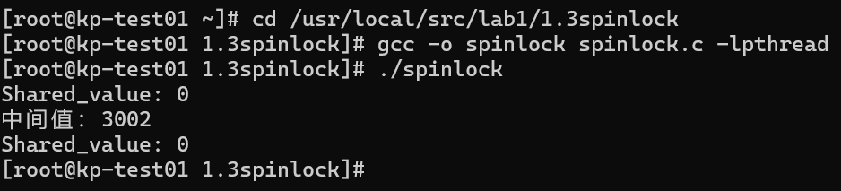  
输出结果正确，进行了5000次+2和5000次-2操作，最终结果为0；中间结果不为0。互斥正确，自旋等待正确。

### 3.思考题

1. system()与exec()的不同？system()：创建一个子进程执行命令，执行完后返回到调用进程。
   exec()：替换当前进程为新进程，如果成功执行，不会返回到原调用进程。
2. 线程与进程的不同？进程是一个独立的运行环境，是程序的一次执行实例。每个进程都有自己独立的内存空间、资源和执行上下文。进程有自己的地址空间，进程间的内存是相互隔离的，一个进程不能直接访问另一个进程的内存。进程有自己的资源，比如文件句柄、设备和网络连接等。创建和切换进程开销较大，因为需要分配和管理独立的内存空间，以及保存和恢复进程的上下文。进程间通信比较复杂，需要使用诸如管道、消息队列、共享内存等机制。
   线程是进程中的一个执行单元，一个进程可以包含多个线程，它们共享进程的内存空间和资源。线程共享同一进程的地址空间，线程之间可以直接访问同一进程内的变量和数据。线程共享进程的资源，因此线程的创建和管理比进程轻量。创建和切换线程的开销较小，因为线程共享进程的内存空间和资源，只需维护线程的栈和寄存器。线程间通信更加简单，因为它们共享相同的地址空间，可以直接读写共享数据
3. 实现线程间的同步与互斥
   采用锁机制，配合PV操作可以实现线程间的同步与互斥。

## 实验二 进程通信与内存管理

### 1.实验概述

2.1中，实现了进程的软中断通信，使用了系统调用 `fork()`创建了两个子进程，再调用 `signal()`让父进程捕捉键盘上发出的中断信号，并调用 `kill()`向两个紫禁城发出16，17的中断信号，子进程接收到中断信号后终止。父进程调用 `wait()`等待两个子进程终止后再终止。
2.2中，实现了一个管道通信，在有锁和无锁的情况下分别由两个子进程向管道分别写入2000个字符，父进程从管道中读出最终结果，输出最红结果并比较。
2.3中，实现了内存管理的基本模型，并分别实现了FF,BF,WF三种内存空间分配算法（可以由使用者选择）。

### 2.代码描述

#### 2.1 进程的软中断通信

在父进程中，创建了两个子进程，其进程标识分别为 `pid1`和 `pid2`。父进程通过 `signal()`系统调用等待键盘输入信号 `SIGINT`,`SIGQUIT`或 `SIGALRM`，调用 `inter_handler()`判断中断信号类型，并设置信号旗帜 `flag`。在两个子进程中，分别使用 `signal()`系统调用等待16，17两个软中断代码，并分别调用 `child1_handler()`和 `child2_handler()`函数以实现两个进程对应的输出和自我中断。在父进程中，使用 `wait()`系统调用来等待两个子进程的终止，之后自我终止。

```C

// softstop.c

#include <unistd.h>
#include <signal.h>
#include <stdio.h>
#include <stdlib.h>
#include <sys/wait.h>

int pid1, pid2;

int main() {
    int fd[2];
    char InPipe[5000]; // read buffer
    char* inpipe;
    inpipe = InPipe;
    char c1 = '1', c2 = '2';
    int size = sizeof(char);
    pipe(fd); // create pipe
    while((pid1 = fork()) == -1){
        ; // fork failed, spin
    }
    if(pid1 == 0) {
        // child process1
        int i;
        lockf(fd[1], 1, 0);// lock pipe

        // write '1' into pipe for 2000 times
        for(i = 0; i < 2000; i++) {
            write(fd[1], &c1, size);
        }

        sleep(5); // wait for reading
        lockf(fd[1], 0, 0); // unlock pipe

        exit(0);
    }
    else {
        while((pid2 = fork()) == -1) {
            ; // fork failed, spin
        }
        if(pid2 == 0) {
            // child process2
            int j;
            lockf(fd[1], 1, 0); // lock pipe
          
            // write '2' into pipe for 2000 times
            for(j = 0; j < 2000; j++) {
                write(fd[1], &c2, size);
            }
          
            sleep(5); // wait for reading
            lockf(fd[1], 0, 0);//unlock pipe
            exit(0);
        }
        else {
            wait(NULL);// wait for stop of process1
            wait(NULL);// wait for stop of process2
            // read 4000 char from pipe
            close(fd[1]);
            read(fd[0], inpipe, 4000);
            *(inpipe + 4000) = '\0';// add end status
            printf("%s\n", InPipe);
            exit(0); // end of parent process
        }
    }
}

```

#### 2.2 进程的管道通信

在2.2中，定义了一个int类型数组 `int fd[2]`，并将其与管道的读写端关联。之后定义一个长度为5000的缓冲区 `char InPipe[5000]`。之后在子进程1中向管道的写端写入2000个字符1并在子进程2中向管道写入2000个字符2。在写之前，采用 `lockf()`方法对管道上锁，在写操作完成之后，采用同样的方法对管道解锁，即可实现两个进程的互斥写入，并在父进程中一次性读出4000个字符。

```C

// pipe.c


#include <unistd.h>
#include <signal.h>
#include <stdio.h>
#include <stdlib.h>
#include <sys/wait.h>

int pid1, pid2;

int main() {
    int fd[2];
    char InPipe[5000]; // read buffer
    char* inpipe;
    inpipe = InPipe;
    char c1 = '1', c2 = '2';
    int size = sizeof(char);
    pipe(fd); // create pipe
    while((pid1 = fork()) == -1){
        ; // fork failed, spin
    }
    if(pid1 == 0) {
        // child process1
        int i;
        lockf(fd[1], 1, 0);// lock pipe

        // write '1' into pipe for 2000 times
        for(i = 0; i < 2000; i++) {
            write(fd[1], &c1, size);
        }

        sleep(5); // wait for reading
        lockf(fd[1], 0, 0); // unlock pipe

        exit(0);
    }
    else {
        while((pid2 = fork()) == -1) {
            ; // fork failed, spin
        }
        if(pid2 == 0) {
            // child process2
            int j;
            lockf(fd[1], 1, 0); // lock pipe
          
            // write '2' into pipe for 2000 times
            for(j = 0; j < 2000; j++) {
                write(fd[1], &c2, size);
            }
          
            sleep(5); // wait for reading
            lockf(fd[1], 0, 0);//unlock pipe
            exit(0);
        }
        else {
            wait(NULL);// wait for stop of process1
            wait(NULL);// wait for stop of process2
            // read 4000 char from pipe
            close(fd[1]);
            read(fd[0], inpipe, 4000);
            *(inpipe + 4000) = '\0';// add end status
            printf("%s\n", InPipe);
            exit(0); // end of parent process
        }
    }
}

```

#### 2.3 内存分配与管理

实现了一个简单的内存管理系统。
实现时，先定义空闲块和已分配块的数据结构，如下：

```C
/*描述每一个空闲块的数据结构*/
struct free_block_type{
    int size;
    int start_addr;
    struct free_block_type *next;
};
/*指向内存中空闲块链表的首指针*/
struct free_block_type *free_block;

/*每个进程分配到的内存块的描述*/
struct allocated_block{
    int pid;
    int size;
    int start_addr;
    char process_name[PROCESS_NAME_LEN];
    struct allocated_block *next;
};
/*进程分配内存块链表的首指针*/
struct allocated_block *allocated_block_head = NULL;
```

之后，根据已经定义的数据结构，首先初始化一个空闲的内存块，大小为已经设置的默认总内存大小（1024字节）：

```C
/*初始化空闲块，默认为一块，可以指定大小及起始地址*/
struct free_block_type* init_free_block(int mem_size){
    struct free_block_type *fb;
    fb = (struct free_block_type *)malloc(sizeof(struct free_block_type));
    if (fb == NULL)
    {
        printf("No mem\n");
        return NULL;
    }
    fb->size = mem_size;
    fb->start_addr = DEFAULT_MEM_START;
    fb->next = NULL;
    return fb;
}
```

之后，展示简单的交互界面，接受用户的操作请求，并调用对应函数实现对应功能。

```C
    display_menu(); //显示菜单
    fflush(stdin);
    choice = getchar(); // 获取用户输入
    switch(choice){
        case '1': set_mem_size(); break;                //设置内存大小
        case '2': set_algorithm(); flag = 1; break;     // 设置算法
        case '3': new_process(); flag = 1; break;       // 创建新进程
        case '4': kill_process(); flag = 1; break;      // 删除进程
        case '5': display_mem_usage(); flag =1 ; break; // 显示内存使用
        case '0': do_exit(); exit(0);                   //释放链表并退出
        default: break; 
    } 
```

显示效果如下：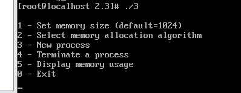  
各个操作的实现如下：

1. 设置总内存大小
   该功能有一个全局变量 `int flag`用于避免内存大小重复设置。在接受用户输入内存大小 `memsize`后，将初始化好的初始空闲内存块大小设置为 `memsize`，并将 `flag`置位。之后如果再次设置总内存大小，将判断 `flag`的值并拒绝请求。
   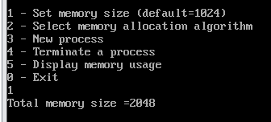  
   实现代码如下：

```C
/*设置内存的大小*/
int set_mem_size(){
    int size;
    if (flag != 0)
    { // 防止重复设置
        printf("Cannot set memory size again\n");
        return 0;
    }
    printf("Total memory size =");
    scanf("%d", &size);
    if (size > 0)
    {
        mem_size = size;
        free_block->size = mem_size;
    }
    flag = 1;
    return 1;
}
```

2. 选择内存分配算法
   一共实现了三种算法，可供用户选择，分别为首次适应（FF），最佳适应（BF），最差适应（WF）。接受用户输入后，调用函数 `rearrange()`对三种算法予以区分，并分别调用对应的函数整理空闲内存链表。

```C
/* 设置当前的分配算法 */
void set_algorithm(){
    int algorithm;
    printf("\t1 - First Fit\n");
    printf("\t2 - Best Fit \n");
    printf("\t3 - Worst Fit \n");
    scanf("%d", &algorithm);
    if (algorithm >= 1 && algorithm <= 3)
        ma_algorithm = algorithm;
    // 按指定算法重新排列空闲区链表
    rearrange(ma_algorithm);
}

/*按指定的算法整理内存空闲块链表*/
void rearrange(int algorithm){  
    switch(algorithm){
        case MA_FF: rearrange_FF(); break;
        case MA_BF: rearrange_BF(); break;
        case MA_WF: rearrange_WF(); break;
    }
}

/*按 FF 算法重新整理内存空闲块链表*/
void rearrange_FF(){
    struct free_block_type *fbt,*work, *minblock;
    work = free_block;
    if (work->next == NULL)
        return;
   
    // Sort by starting address
    while (work)
    {
        fbt = work;
        int min = 0x7FFFFFFF;
        while (fbt){
            if (fbt->start_addr < min)
            {
                min = fbt->start_addr;
                minblock = fbt;
            }
            fbt = fbt->next;
        }
        int temp_size, temp_addr;
        temp_size = work->size;
        temp_addr = work->start_addr;
        work->size = minblock->size;
        work->start_addr = minblock->start_addr;
        minblock->size = temp_size;
        minblock->start_addr = temp_addr;
        work = work->next;
    }
}

/*按 BF 算法重新整理内存空闲块链表*/
void rearrange_BF(){
    struct free_block_type *fbt,*work, *minblock;
    work = free_block;
    if (work->next == NULL)
        return;
  
    // Sort from smallest to largest based on memory size
    while (work)
    {
        fbt = work;
        int min = 0x7FFFFFFF;
        while (fbt){
            if (fbt->size < min)
            {
                min = fbt->size;
                minblock = fbt;
            }
            fbt = fbt->next;
        }
        int temp_size, temp_addr;
        temp_size = work->size;
        temp_addr = work->start_addr;
        work->size = minblock->size;
        work->start_addr = minblock->start_addr;
        minblock->size = temp_size;
        minblock->start_addr = temp_addr;
        work = work->next;
    }
}

/*按 WF 算法重新整理内存空闲块链表*/
void rearrange_WF(){
    struct free_block_type *fbt,*work, *maxblock;
    work = free_block;
    if (work->next == NULL)
        return;
  
    // Sort from smallest to largest based on memory size
    while (work)
    {
        fbt = work;
        int max = -1;
        while (fbt){
            if (fbt->size > max)
            {
                max = fbt->size;
                maxblock = fbt;
            }
            fbt = fbt->next;
        }
        int temp_size, temp_addr;
        temp_size = work->size;
        temp_addr = work->start_addr;
        work->size = maxblock->size;
        work->start_addr = maxblock->start_addr;
        maxblock->size = temp_size;
        maxblock->start_addr = temp_addr;
        work = work->next;
    }
}
```

3. 创建新的进程
   该过程并不实际创建进程，只是模拟新进程创建时内存空间的申请和分配。首先接受用户请求的内存大小，调用函数 `allocate_mem()`进行内存空间分配。如果分配成功，函数 `allocate_mem()`返回已分配块的元数据指针，之后，将分配好的块插入已分配块的链表中：
   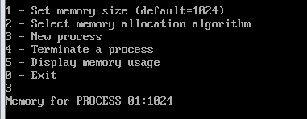  
   如果申请空间多于所有空间的总和，则分配失败：
   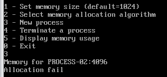  
   实现代码如下：

```C
/*创建新的进程，主要是获取内存的申请数量*/
int new_process(){
    struct allocated_block *ab;
    int size;
    int ret;
    ab = (struct allocated_block *)malloc(sizeof(struct allocated_block));
    if (!ab) exit(-5);
    ab->next = NULL;
    pid++;
    sprintf(ab->process_name, "PROCESS-%02d", pid);
    ab->pid = pid;
    printf("Memory for %s:", ab->process_name);
    scanf("%d", &size);
    if (size > 0)
        ab->size = size;
    ret = allocate_mem(ab); /* 从空闲区分配内存， ret==1 表示分配 ok*/
    /*如果此时 allocated_block_head 尚未赋值，则赋值*/
    if ((ret == 1) && (allocated_block_head == NULL))
    {
        allocated_block_head = ab;
        return 1;
    }
    /*分配成功，将该已分配块的描述插入已分配链表*/
    else if (ret == 1){
        ab->next = allocated_block_head;
        allocated_block_head = ab;
        return 2;
    }
    else if(ret == -1){ /*分配不成功*/
        printf("Allocation fail\n");
        free(ab);
        return -1;
    }
    return 3;
}

/*分配内存模块*/
int allocate_mem(struct allocated_block *ab){
    struct free_block_type *fbt, *pre;
    int request_size = ab->size;
    int free_sum = 0; // sum the size of all the free blocks
    fbt = pre = free_block;
    while (fbt) // traverse the free block link list
    {
        if(fbt == NULL)
            return -1;
        free_sum += fbt->size; // get the present sum
        if (fbt->size >= request_size)
        {   // allocate the block
            ab->start_addr = fbt->start_addr;
          
            // cut free block
            if(fbt->size == request_size){ // exactly the size requested
                if(pre == fbt && fbt->next == NULL){ // if is the first and the only free block
                    fbt->size = 0;
                }
                else if(pre == fbt && fbt->next){ // if is the first but not the only free block
                    free_block = fbt->next;
                    free(fbt);
                }
                else{ // neither the first nor the only free block
                    pre->next = fbt->next;
                    free(fbt);
                }
            }
            else{  // bigger than requested, modify the size and the start_addr
                fbt->start_addr += request_size;
                fbt->size -= request_size;
            }
            rearrange(ma_algorithm);
            return 1; // if free block found, function should end here
        }
        pre = fbt;
        fbt = fbt->next;
    }
  
    if(free_sum >= request_size){ // not found, do memory compression
        struct allocated_block *head = allocated_block_head;
        struct free_block_type *fbt_n, *pre_n;
        fbt_n = pre_n = free_block;
        int addr_new = 0;

        while (head)
        {
            head->start_addr = addr_new;
            addr_new += head->size;
            head = head->next;
        }
        ab->start_addr = addr_new;
        addr_new += request_size;

        // There must be over one free block
        fbt_n = fbt_n->next;
        while (fbt_n)
        {
            pre_n = fbt_n;
            fbt_n = fbt_n->next;
            free(pre_n);
        }
        free_block->start_addr = addr_new;
        free_block->size = mem_size - addr_new;
        free_block->next = NULL;

        rearrange(ma_algorithm);
        return 1;
    }
    return -1;
}
```

4. 终止进程
   与创建进程一样，只是模拟进程终止时内存空间的释放，而不实际终止一个进程。先调用函数 `find_process()`找到对应的进程，然后将该进程对应的已分配块归还至空闲块（通过创建一个新的空闲块元数据结构，并将其大小设置为将要释放的块的大小，来实现“归还”功能）之后，将已分配块的元数据结构删除。之后，对空闲块的链表实施可能的合并，并按照已经设置好的算法调用对应函数重新整理空闲块的队列。效果如下：
   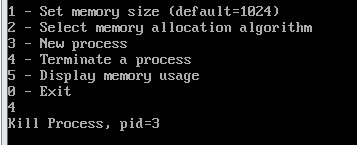  
   实现代码如下：

```C
/*删除进程，归还分配的存储空间，并删除描述该进程内存分配的节点*/
void kill_process(){
    struct allocated_block *ab;
    int pid;
    printf("Kill Process, pid=");
    scanf("%d", &pid);
    ab = find_process(pid);
   
    if (ab != NULL)
    {
        free_mem(ab); /*释放 ab 所表示的分配区*/
        dispose(ab);  /*释放 ab 数据结构节点*/
    }
}

struct allocated_block *find_process(int pid){
    struct allocated_block *ab = allocated_block_head;
    while(ab){
        if(ab->pid == pid) 
            return ab;
        ab = ab->next;
    }
    return NULL;
}

/*将 ab 所表示的已分配区归还，并进行可能的合并*/
int free_mem(struct allocated_block *ab){
    int algorithm = ma_algorithm;
    struct free_block_type *fbt, *pre, *work;
    fbt = (struct free_block_type *)malloc(sizeof(struct free_block_type));
    if (!fbt)
        return -1;
    fbt->start_addr = ab->start_addr;
    fbt->size = ab->size;

    // Put new block in the end
    work = free_block;
    if(work){
        while(work->next){
            work = work->next;
        }
        work->next = fbt;
    }
    else{
        free_block = fbt;
    }
    rearrange_FF();

    // Merge adjacent regions
    pre = free_block;
    work = free_block->next;
    while(work){
        if(pre->start_addr + pre->size == work->start_addr){
            pre->size += work->size;
            pre->next = work->next;
            free(work);
            work = pre->next;
        }
        else{
            pre = work;
            work = work->next;
        }
    }

    rearrange(ma_algorithm);
    return 1;
}

/*释放 ab 数据结构节点*/
int dispose(struct allocated_block *free_ab){
    struct allocated_block *pre, *ab;
    if (free_ab == allocated_block_head)
    { /*如果要释放第一个节点*/
        allocated_block_head = allocated_block_head->next;
        free(free_ab);
        return 1;
    }
    pre = allocated_block_head;
    ab = allocated_block_head->next;
    while (ab != free_ab)
    {
        pre = ab;
        ab = ab->next;
    }
    pre->next = ab->next;
    free(ab);
    return 2;
}
```

5. 展示内存使用情况
   展示当前所有空闲块和已分配块的内存使用情况。效果如下：
   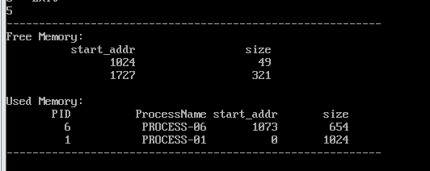  
   实现代码如下：

```C
/* 显示当前内存的使用情况，包括空闲区的情况和已经分配的情况 */
int display_mem_usage(){
    struct free_block_type *fbt = free_block;
    struct allocated_block *ab = allocated_block_head;
    if (fbt == NULL)
        return (-1);
    printf("----------------------------------------------------------\n"); /* 显示空闲区 */
    printf("Free Memory:\n");
    printf("%20s %20s\n", " start_addr", " size");
    while (fbt != NULL)
    {
        printf("%20d %20d\n", fbt->start_addr, fbt->size);
        fbt = fbt->next;
    }
    /* 显示已分配区 */
    printf("\nUsed Memory:\n");
    printf("%10s %20s %10s %10s\n", "PID", "ProcessName", "start_addr", " size");
    while (ab != NULL)
    {
        printf("%10d %20s %10d %10d\n", ab->pid, ab->process_name,
               ab->start_addr, ab->size);
        ab = ab->next;
    }
    printf("----------------------------------------------------------\n");
    return 0;
}
```

6. 终止整个内存分配模拟系统
   释放所有空间和元数据结构，并退出整个进程。实现代码如下：

```C
void do_exit(){
    struct free_block_type *ftb, *del;
    struct allocated_block *alb, *dela;
    ftb = free_block;
    alb = allocated_block_head;
    while (ftb){
        del = ftb;
        ftb = ftb->next;
        free(del);
    }
    while(alb){
        dela = alb;
        alb = alb->next;
        free(dela);
    }
}
```

由于整个内存分配模拟系统的完整实现代码就是上述所有代码块的组合，故不再浪费篇幅完整地列出。

### 3.思考题

#### 1. 对三个算法进行比较

1. FF（First Fit，首次适应）算法思想：按内存地址从低到高顺序扫描空闲内存块，找到第一个能够满足请求大小的空闲块，并将其分配给请求。优点：简单高效，查找速度快，因为找到第一个符合条件的块后立即分配，只需从头到尾扫描空闲块列表。缺点：容易产生内存碎片，因为总是优先使用低地址的空闲块，导致高地址处可能有更多零散的小碎片。提高查找性能的方法：空闲列表分区：将空闲内存块按大小分区管理，小块和大块分别存储，减少扫描时间。索引数据结构：使用哈希表或平衡树等索引数据结构，快速定位符合条件的空闲块。
2. BF（Best Fit，最佳适应）算法思想：
   扫描所有空闲内存块，找到最小的一个能够满足请求大小的空闲块，并将其分配给请求。优点：有效减少内存碎片，因为选择的空闲块尽量接近请求大小，减少剩余空间。内存利用率较高。缺点：查找速度较慢，因为需要扫描所有空闲块以找到最佳匹配。可能会产生小碎片堆积在高地址区域。提高查找性能的方法：分段空闲列表：将空闲内存按大小分段管理，避免遍历整个空闲列表。快速查找结构：使用红黑树或AVL树等平衡树结构，以提高查找效率。
3. WF（Worst Fit，最坏适应）
   算法思想：
   扫描所有空闲内存块，找到最大的一个空闲块，并将其分配给请求。
   优点：
   减少小碎片产生，因为优先分配大块空闲内存。
   保留大块内存空间，适合处理大块内存请求。
   缺点：
   查找速度较慢，因为需要扫描所有空闲块以找到最大的块。可能会浪费内存，因为选择的块可能远大于请求大小。
   提高查找性能的方法：
   分级空闲列表：将空闲内存块按大小分级管理，快速找到最大的空闲块。
   平衡树结构：使用堆或树状结构管理空闲块，快速定位最大块。

#### 2. 内碎片、外碎片，紧缩功能解决的是什么碎片？

1. 内碎片（Internal Fragmentation）定义：内碎片是指已分配的内存块内部未被使用的空间。因为内存分配是按照固定大小的块进行的，实际使用的内存可能比分配的内存块要小，从而导致内部有未使用的空间。产生原因：内存块的分配大小大于实际需求。例如，如果系统按4KB的块分配内存，而一个程序只需要3KB，则剩下的1KB就成为内碎片。影响：内碎片导致内存利用率降低，因为分配的内存块中有一部分无法使用。
2. 外碎片（External Fragmentation）
   定义：外碎片是指未分配的内存碎片散布在已分配内存块之间，虽然这些碎片的总和足够大，但由于不连续，无法满足一个大块内存的分配请求。产生原因：随着进程的不断分配和释放内存，小块的空闲内存散布在整个内存空间中。即使空闲内存总量足够大，但由于不连续，可能无法分配给新的大块内存请求。影响：外碎片导致内存不能高效利用，可能会出现需要分配大块内存时，尽管总空闲内存足够，但无法找到连续的足够大块内存。
3. 紧缩功能（Compaction）
   解决问题：紧缩功能主要解决外碎片问题。通过将分散的空闲内存块移动到一起形成一个或多个大的连续内存块，从而提高内存利用率。

## 实验三 Linux动态模块与设备驱动

### 1.实验概述

实验分为两个部分。第一部分为Linux内核动态模块加载，即使用Linux提供的动态模块加载机制，将系统调用 `gettimeofday()`替换为 `hello()`；第二部分为Linux设备驱动，即编写一个简单的字符驱动程序，以内核空间模拟字符设备，完成了对该设备的打开，读写和释放操作。

### 2.代码分析

#### 2.1 Linux动态模块部分

代码分为四部分，即 `modify_syscall.c`(用于修改系统调用),`modify_old_syscall.c``modiify_new_syscall.c`(用于测试用户程序),`Makefile`(用于编译内核模块)。

##### 2.1.1 `modify_syscall.c`

为了hook系统调用，应当首先获得系统调用函数的地址。用户通过 `syscall()`函数和特定的系统调用号来进行系统调用。在x86_64环境的虚拟机中，`gettimeofday()`系统调用号为96，其地址存储在系统调用表 `sys_call_table`中，应当先设法获取调用表的地址，再通过计算获取所需函数的地址。获取系统调用表采用系统内置函数 `kallsyms_lookup_name()`,但在Linux5.7版本之后，该符号不再导出，无法直接使用。所以，先通过 `kprobe`方法，封装成函数 `generic_kallsyms_lookup_name()`,并以此代替函数 `kallsyms_lookup_name`查找系统调用表的地址。
避开 `kallsyms_lookup_name()`的方法如下：

```C
#if LINUX_VERSION_CODE >= KERNEL_VERSION(5, 7, 0) || LINUX_VERSION_CODE < KERNEL_VERSION(2, 6, 33)


static unsigned long (*kallsyms_lookup_name_sym)(const char *name);

static int _kallsyms_lookup_kprobe(struct kprobe *p, struct pt_regs *regs)
{
        return 0;
}

unsigned long get_kallsyms_func(void)
{
        struct kprobe probe;
        int ret;
        unsigned long addr;

        memset(&probe, 0, sizeof(probe));
        probe.pre_handler = _kallsyms_lookup_kprobe;
        probe.symbol_name = "kallsyms_lookup_name";
        ret = register_kprobe(&probe);
        if (ret)
                return 0;
        addr = (unsigned long)probe.addr;
        unregister_kprobe(&probe);
        return addr;
}

unsigned long generic_kallsyms_lookup_name(const char *name)
{
        /* singleton */
        if (!kallsyms_lookup_name_sym) {
                kallsyms_lookup_name_sym = (void *)get_kallsyms_func();
                if(!kallsyms_lookup_name_sym)
                        return 0;
        }
        return kallsyms_lookup_name_sym(name);
}

#else

unsigned long generic_kallsyms_lookup_name(const char *name)
{
    return kallsyms_lookup_name(name);
}

#endif
```

在这之后，只需要用新的查找方法，查找系统调用表的地址即可：

```C
void modify_syscall(void)
{
    unsigned long *sys_call_addr;
    p_sys_call_table = (unsigned long )generic_kallsyms_lookup_name("sys_call_table");
    if (!p_sys_call_table) {
        pr_err("Failed to find sys_call_table address\n");
        return;
        }
      
    sys_call_addr = (unsigned long *)(p_sys_call_table + sys_No * sizeof(void *));
    old_sys_call_func = *(sys_call_addr);
    orig_cr0 = clear_cr0(); 
    *(sys_call_addr) = (unsigned long)&hello; // point to new function
    setback_cr0(orig_cr0);
}

void restore_syscall(void)
{
    unsigned long *sys_call_addr;

    sys_call_addr = (unsigned long *)(p_sys_call_table + sys_No * sizeof(void *));
    orig_cr0 = clear_cr0();
    *(sys_call_addr) = old_sys_call_func; // point to original function
    setback_cr0(orig_cr0);
}
```

通过系统调用表获取 `gettimeofday()`的地址后，应当改写cr0寄存器，以此取消对内核空间的写保护，之后将调用表的指针指向新的函数 `hello()`.此时，系统调用已被篡改。在恢复时，应当将调用表中指针指回旧的系统调用函数 `gettimeofday()`,并将写保护位cr0恢复。修改系统保护位的方法如下：

```C
unsigned int clear_cr0(void)      
{
        unsigned int cr0 = 0;
        unsigned int ret;
        //move the value in reg cr0 to reg rax      
        asm volatile ("movq %%cr0, %%rax" : "=a"(cr0));      
        ret = cr0;    
        cr0 &= 0xfffeffff; //set 0 to the 17th bit   
        asm volatile ("movq %%rax, %%cr0" :: "a"(cr0));      
        return ret;
}

//recover the value of WP 
void setback_cr0(unsigned int val)
{      
        asm volatile ("movq %%rax, %%cr0" :: "a"(val));
}
```

在向新的系统调用传参的过程中，指导书给的方法是采用 `asmlinkage`标识，使得系统不从寄存器而是从函数栈上读取参数。对此查阅资料得知，在32位的x86中，系统将参数直接写到堆栈上，但在x64系统中，为了内核读写的速度，直接采用寄存器传参，而不采用堆栈传参（省去了一次内存写和一次内存读的时间）。所以如果仍旧采用 `asmlinkage`标识，则会输出错误的值。因此，修改 `hello()`函数代码如下：

```C
int hello(const struct pt_regs *regs) //new function
{
    printk(KERN_ALERT"No.96 syscall has changed to function hello\n");
    int a = 0;
    int b = 0;
    a = regs->di;
    b = regs->si;
    return a+b;
}
```

采用了 `const struct pt_regs`类型变量，直接用寄存器传参，从而得到正确的参数值。

完整的代码如下：

```C

// modify_syscall.c

#include <linux/init.h>
#include <linux/kernel.h>
#include <linux/module.h>
#include <linux/kallsyms.h>
#include <linux/kprobes.h>
#include <linux/version.h>

//original,syscall 96 function: gettimeofday
// new syscall 96 function: print "No 96 syscall has changed to hello"and return a+b

#define sys_No 96
unsigned long old_sys_call_func;
unsigned long p_sys_call_table; // find in /boot/System.map-'uname -r'
unsigned long orig_cr0;


// *************************************************************************************************************

#if LINUX_VERSION_CODE >= KERNEL_VERSION(5, 7, 0) || LINUX_VERSION_CODE < KERNEL_VERSION(2, 6, 33)


static unsigned long (*kallsyms_lookup_name_sym)(const char *name);

static int _kallsyms_lookup_kprobe(struct kprobe *p, struct pt_regs *regs)
{
        return 0;
}

unsigned long get_kallsyms_func(void)
{
        struct kprobe probe;
        int ret;
        unsigned long addr;

        memset(&probe, 0, sizeof(probe));
        probe.pre_handler = _kallsyms_lookup_kprobe;
        probe.symbol_name = "kallsyms_lookup_name";
        ret = register_kprobe(&probe);
        if (ret)
                return 0;
        addr = (unsigned long)probe.addr;
        unregister_kprobe(&probe);
        return addr;
}

unsigned long generic_kallsyms_lookup_name(const char *name)
{
        /* singleton */
        if (!kallsyms_lookup_name_sym) {
                kallsyms_lookup_name_sym = (void *)get_kallsyms_func();
                if(!kallsyms_lookup_name_sym)
                        return 0;
        }
        return kallsyms_lookup_name_sym(name);
}

#else

unsigned long generic_kallsyms_lookup_name(const char *name)
{
    return kallsyms_lookup_name(name);
}

#endif

// ****************************************************************************************

unsigned int clear_cr0(void)      
{
        unsigned int cr0 = 0;
        unsigned int ret;
        //move the value in reg cr0 to reg rax
        //movl moves a 32-bits operand
        //movq moves a 64-bits operand
        //rax is a 64-bits register
        //an assembly language code
        //asm volatile ("movl %%cr0, %%eax" : "=a"(cr0));//32-bits      
        asm volatile ("movq %%cr0, %%rax" : "=a"(cr0));        //64-bits
        ret = cr0;
        //var cr0 is rax      
        cr0 &= 0xfffeffff; //set 0 to the 17th bit
        //asm volatile ("movl %%eax, %%cr0" :: "a"(cr0));//32-bits
        //note that cr0 above is a variable while cr0 below is a reg.      
        asm volatile ("movq %%rax, %%cr0" :: "a"(cr0));      
        return ret;
}

//recover the value of WP 
void setback_cr0(unsigned int val)
{      
        //asm volatile ("movl %%eax, %%cr0" :: "a"(val));//32-bits
        asm volatile ("movq %%rax, %%cr0" :: "a"(val));//64-bits
}

int hello(const struct pt_regs *regs) //new function
{
    printk(KERN_ALERT"No.96 syscall has changed to function hello\n");
    int a = 0;
    int b = 0;
    a = regs->di;
    b = regs->si;
    return a+b;
}

void modify_syscall(void)
{
    unsigned long *sys_call_addr;
    p_sys_call_table = (unsigned long )generic_kallsyms_lookup_name("sys_call_table");
    if (!p_sys_call_table) {
        pr_err("Failed to find sys_call_table address\n");
        return;
        }
      
    sys_call_addr = (unsigned long *)(p_sys_call_table + sys_No * sizeof(void *));
    old_sys_call_func = *(sys_call_addr);
    orig_cr0 = clear_cr0(); 
    *(sys_call_addr) = (unsigned long)&hello; // point to new function
    setback_cr0(orig_cr0);
}

void restore_syscall(void)
{
    unsigned long *sys_call_addr;

    sys_call_addr = (unsigned long *)(p_sys_call_table + sys_No * sizeof(void *));
    orig_cr0 = clear_cr0();
    *(sys_call_addr) = old_sys_call_func; // point to original function
setback_cr0(orig_cr0);
}

static int mymodule_init(void)
{
    modify_syscall();
    return 0;
}

static void mymodule_exit(void)
{
    restore_syscall();
}


module_init(mymodule_init);
module_exit(mymodule_exit);
MODULE_LICENSE("GPL");

```

##### 2.1.2 其他三部分代码

`modify_old_syscall.c`和 `modify_new_syscall.c`代码都是用和测试程序。在加载模块后，执行这两部分代码，通过输出可以知道系统调用已经被篡改。
`Makefile`文件规定了编译规则。采用

```
CONFIG_MODULE_SIG=n
```

给予权限，采用

```
obj-m := modify_syscall.o # 编译成外部模块
```

将 `modify_syscall.c`编译成外部模块 `modify_syscall.ko`以便加载进内核。
此三部分的源代码如下：

```C

// modify_old_syscall.c

#include<stdio.h>
#include<sys/time.h>
#include<unistd.h>

int main()
{
    struct timeval tv;
    syscall(96, &tv, NULL); // before modify syscall 96 :gettimeofday
    printf("tv_sec:%d\n", tv.tv_sec);
    printf("tv_usec:%d\n", tv.tv_usec);
    return 0;
} 

```

```C

// modify_new_syscall.c

#include<stdio.h> 
#include<sys/time.h> 
#include<unistd.h> 
int main() 
{ 
 int ret=syscall(78,10,20); //after modify syscall 78 
 printf("%d\n",ret); 
 return 0; 
} 

```

```

# Makefile

CONFIG_MODULE_SIG=n
ifneq ($(KERNELRELEASE),)
obj-m := modify_syscall.o # 编译成外部模块
else
KERNELDIR := /lib/modules/$(shell uname -r)/build # 定义一个变量，指向内核目录
PWD := $(shell pwd)

modules:
    $(MAKE) -C $(KERNELDIR) M=$(PWD) modules # 编译内核模块

clean:
    $(MAKE) -C $(KERNELDIR) M=$(PWD) clean # 清理编译产生的文件
    rm -f modify_old_syscall modify_new_syscall

all : modify_old_syscall modify_new_syscall 
.PHONY : all
modify_old_syscall: modify_old_syscall.c
    gcc -o $@ $<
modify_new_syscall: modify_new_syscall.c
    gcc -o $@ $<

  
endif

```

##### 2.1.3 运行结果

加载模块前，运行结果如下：
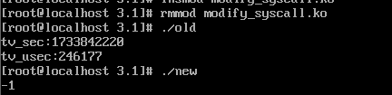  
`old`执行结果位系统调用 `gettimeofday()`的结果,即自1970年以来经过的秒数；
`mew`执行结果为-1，因为此时系统调用还未被篡改，系统调用返回-1。

使用命令

```
insmod modify_syscall.ko
```

加载模块之后，运行结果如下：
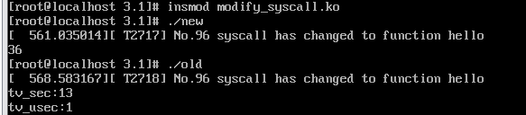  
`new`执行的结果为36，这是因为在 `modify_new_syscall.c`中，向函数传递的参数为10和26，函数 `hello()`返回了两个参数的和；
`old`执行的结果为随机结果，此时系统调用已经被篡改，无法正常返回系统时间。

#### 2.2 Linux设备驱动部分

代码分为三部分：`Makefile`规定了文件的编译规则；`chardev_drive.c`是字符设备的驱动程序，编译成外部模块并加载进入内核；`test_char_device.c`是用户程序。

##### 2.2.1 `chardev_drive.c`

```C
#include <linux/init.h>        // 包含模块初始化和清理函数的定义
#include <linux/module.h>      // 包含加载模块时需要的函数和符号定义
#include <linux/fs.h>
#include <linux/sched.h>
#include <asm/uaccess.h>
#include <linux/init_task.h>
#include <linux/unistd.h>
#include <linux/kernel.h>
#include <linux/string.h>
#include <linux/wait.h>
#include <linux/semaphore.h>
#include <linux/cdev.h>
#include <linux/device.h>
#include <linux/types.h>
#include <linux/kdev_t.h>

MODULE_LICENSE("GPL");

#define MAJOR_NUM 400          // 主设备号
#define MAXNUM 100             // 缓冲区大小

static ssize_t globalvar_read(struct file *, char *, size_t, loff_t*);
static ssize_t globalvar_write(struct file *, const char *, size_t, loff_t*);

// 文件操作结构体
struct file_operations globalvar_fops = {
    .read = globalvar_read,
    .write = globalvar_write,
};

// 自定义设备结构体
struct Scull_Dev {
    struct cdev devm;               // 字符设备
    struct semaphore sem;           // 信号量
    wait_queue_head_t outq;         // 等待队列
    int flag;                       // 阻塞唤醒标志
    char *read, *write, *end;       // 读，写，尾指针
    char buffer[MAXNUM + 1];        // 字符缓冲区
};

struct Scull_Dev globalvar;
static struct class *my_class;
int major = MAJOR_NUM;

// 模块初始化
static int init_mymodule(void) {
    int result = 0;
    int err = 0;
    dev_t dev = MKDEV(major, 0);    // 创建设备编号

    if (major) {
        result = register_chrdev_region(dev, 1, "ch_device");
    } else {
        result = alloc_chrdev_region(&dev, 0, 1, "ch_device");
        major = MAJOR(dev);
    }
    if (result < 0) return result;

    // 初始化字符设备
    cdev_init(&globalvar.devm, &globalvar_fops);
    globalvar.devm.owner = THIS_MODULE;
    err = cdev_add(&globalvar.devm, dev, 1);
    if (err) {
        printk("Error adding cdev\n");
        return err;
    } else {
        printk("ch_device register success\n");
        sema_init(&globalvar.sem, 1);            // 初始化信号量
        init_waitqueue_head(&globalvar.outq);   // 初始化等待队列
        globalvar.read = globalvar.buffer;
        globalvar.write = globalvar.buffer;
        globalvar.end = globalvar.buffer + MAXNUM;
        globalvar.flag = 0;                     // 阻塞唤醒标志置 0
    }

    // 创建设备文件 `/dev/ch_device`
    my_class = class_create(THIS_MODULE, "ch_device");
    device_create(my_class, NULL, dev, NULL, "ch_device");

    return 0;
}

// 模块卸载
static void cleanup_mymodule(void) {
    device_destroy(my_class, MKDEV(major, 0));
    class_destroy(my_class);
    cdev_del(&globalvar.devm);
    unregister_chrdev_region(MKDEV(major, 0), 1);
}

// 读操作实现
static ssize_t globalvar_read(struct file *filp, char *buf, size_t len, loff_t *off) {
    if (wait_event_interruptible(globalvar.outq, globalvar.flag != 0)) {
      

        return -ERESTARTSYS;
    }

    if (down_interruptible(&globalvar.sem)) {
        return -ERESTARTSYS;  // 获取信号量失败
    }

    globalvar.flag = 0;
    printk("read!\n");
    printk("the read is %c\n",*globalvar.read);

    if (globalvar.read < globalvar.write) {
        len = min(len, (size_t)(globalvar.write - globalvar.read));
    } else {
        len = min(len, (size_t)(globalvar.end - globalvar.read));
    }
    printk("the len is %zu\n",len);
    if (copy_to_user(buf, globalvar.read, len)) {
        printk("fail!\n");
        up(&globalvar.sem);
        return -EFAULT;
    }
    printk("read success!\n");
    globalvar.read += len;
    if (globalvar.read == globalvar.end) globalvar.read = globalvar.buffer;

    up(&globalvar.sem);
    return len;
}

// 写操作实现
static ssize_t globalvar_write(struct file *filp, const char *buf, size_t len, loff_t *off) {
    if (down_interruptible(&globalvar.sem)) {
        return -ERESTARTSYS;
    }

    if (globalvar.read <= globalvar.write) {
        len = min(len, (size_t)(globalvar.end - globalvar.write));
    } else {
        len = min(len, (size_t)(globalvar.read - globalvar.write - 1));
    }

    if (copy_from_user(globalvar.write, buf, len)) {
        up(&globalvar.sem);
        return -EFAULT;
    }
    printk("write success!\n");
    globalvar.write += len;
    if (globalvar.write == globalvar.end) globalvar.write = globalvar.buffer;

    up(&globalvar.sem);
    globalvar.flag = 1;
    wake_up_interruptible(&globalvar.outq);  // 唤醒阻塞的读进程
    return len;
}

module_init(init_mymodule);
module_exit(cleanup_mymodule);
```

##### 2.2.2 其他部分代码

```
# Makefile

CONFIG_MODULE_SIG=n
ifneq ($(KERNELRELEASE),)
obj-m := chardev_drive.o # 编译成外部模块
else
KERNELDIR := /lib/modules/$(shell uname -r)/build # 定义一个变量，指向内核目录
PWD := $(shell pwd)

modules:
    $(MAKE) -C $(KERNELDIR) M=$(PWD) modules # 编译内核模块

clean:
    $(MAKE) -C $(KERNELDIR) M=$(PWD) clean # 清理编译产生的文件

all : test
.PHONY : all
test: test_char_device.c
    gcc -o $@ $<

endif
```

```C

// test_char_device.c  

#include <sys/types.h>
#include <sys/stat.h>
#include <stdio.h>
#include <fcntl.h>
#include <string.h>
#include <unistd.h> // read, write, close
#include <stdlib.h> // exit

int main()
{
    int fd;
    char num[101], temp;

    printf("1>write\n2>read\n");
    temp = getchar();
    getchar(); // 清除换行符

    if (temp == '2') { // 读
        fd = open("/dev/ch_device", O_RDWR, S_IRUSR | S_IWUSR); // 修改设备路径为 /dev/ch_device
        if (fd == -1) {
            perror("Device open failure");
            exit(EXIT_FAILURE);
        }

        printf("Reading from /dev/ch_device:\n");
        while (1) {
            memset(num, '\0', sizeof(num));
            int ret = read(fd, num, 100);
          
            if (ret < 0) {
                perror("Read failed");
                close(fd);
                exit(EXIT_FAILURE);
            } else if (ret == 0) {
                printf("No data to read\n");
                int waitingflag = 0;
                printf("Waiting for data or not?\nEnter 0 to wait, and other numbers to quit waiting.\n");
                scanf("%d", &waitingflag);
                if(!waitingflag) {
                    close(fd);
                    return 0;
                }
                continue; // 等待数据
            }
            num[ret] = '\0'; // 确保字符串以 '\0' 结尾

            printf("Read complete, as follows:\n%s\n", num);
            printf("Continue reading or not?\nEnter 1 to quit reading, and other numbers to continue.\n");
            int quitflag = 0;
            scanf("%d", &quitflag);
            if(quitflag == 1) break;
            else continue;
            // if (strcmp(num, "exit") == 0) {
            //     printf("Exiting read loop\n");
            //     break;
            // }
        }
        close(fd);

    } else if (temp == '1') { // 写
        fd = open("/dev/ch_device", O_RDWR, S_IRUSR | S_IWUSR); // 修改设备路径为 /dev/ch_device
        if (fd == -1) {
            perror("Device open failure");
            exit(EXIT_FAILURE);
        }

        printf("Writing to /dev/ch_device:\n");
        while (1) {
            printf("Please input message (type 'exit' to quit):\n");
            if (fgets(num, sizeof(num), stdin) == NULL) {
                perror("Input error");
                break;
            }
            num[strcspn(num, "\n")] = '\0'; // 去掉换行符

            int ret = write(fd, num, strlen(num));
            if (ret < 0) {
                perror("Write failed");
                close(fd);
                exit(EXIT_FAILURE);
            }

            if (strcmp(num, "exit") == 0) {
                printf("Exiting write loop\n");
                break;
            }
        }
        close(fd);

    } else {
        printf("Invalid option\n");
    }

    return 0;
}

```

上述代码实现了一个字符设备。并可以通过创建多个进程进行共享窗口的对话，并实现了对话时的互斥功能。
